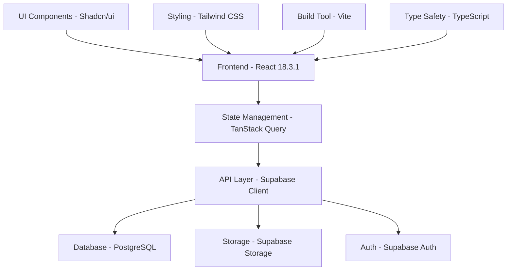

# 📚 Martka Petroleum - Complete Application Documentation

<div align="center">


**Comprehensive Documentation for Martka Petroleum Industrial Equipment Management Platform**

[](https://github.com/martka-petro/releases)
[](Documentation.md)
[](mailto:support@martka-petroleum.com)

[🏠 Back to README](README.md) • [🚀 Quick Start](#-quick-start) • [🔧 API Reference](#-api-reference) • [🎨 Components](#-components)

</div>

---

## 📋 Table of Contents

- [🌟 Application Overview](#-application-overview)
- [🏗️ System Architecture](#️-system-architecture)
- [🚀 Quick Start Guide](#-quick-start-guide)
- [📱 User Interface Documentation](#-user-interface-documentation)
- [🎛️ Admin Panel Guide](#️-admin-panel-guide)
- [🔧 API Reference](#-api-reference)
- [🗄️ Database Schema](#️-database-schema)
- [🎨 Component Library](#-component-library)
- [📂 File Structure](#-file-structure)
- [🔐 Authentication & Security](#-authentication--security)
- [📤 File Upload System](#-file-upload-system)
- [🌐 Deployment Guide](#-deployment-guide)
- [🧪 Testing Documentation](#-testing-documentation)
- [🔧 Configuration](#-configuration)
- [🐛 Troubleshooting](#-troubleshooting)
- [📞 Support & Contact](#-support--contact)

---

## 🌟 Application Overview

### 📖 About Martka Petroleum

Martka Petroleum is a comprehensive industrial equipment management platform built for petroleum equipment companies. The application serves as both a public-facing showcase website and a powerful content management system.

### 🎯 Key Features

#### **Public Website Features**
- **Product Catalog Management**: Comprehensive equipment listings with advanced search and filtering
- **Project Showcase**: Visual presentation of completed industrial projects with case studies
- **Company Information**: Dynamic company details, locations, and contact information
- **Service Offerings**: Detailed service descriptions with feature breakdowns
- **Career Opportunities**: Job listings and application management
- **Support System**: FAQ, downloads, emergency contact, and customer support
- **SEO Optimization**: Advanced SEO features with structured data and meta optimization

#### **Admin Dashboard Features**
- **Content Management**: Real-time content editing for all website sections
- **Product Administration**: Complete product lifecycle management with image galleries
- **Project Management**: Project documentation with timelines, team management, and case studies
- **Media Management**: File upload system with drag-and-drop functionality
- **User Management**: Role-based access control and user administration
- **Analytics Dashboard**: Performance metrics and user engagement tracking
- **Location Management**: Multiple office/facility location management

### 🏢 Target Users

- **Public Users**: Customers browsing products and services
- **Admin Users**: Content managers and administrators
- **Super Admins**: System administrators with full access

---

## 🏗️ System Architecture

### 🔧 Technology Stack



### 📊 Data Flow Architecture

1. **Presentation Layer**: React components with TypeScript
2. **State Management**: TanStack Query for server state, React hooks for local state
3. **API Layer**: Supabase client with real-time subscriptions
4. **Authentication**: Row-level security with Supabase Auth
5. **Storage**: Supabase Storage for media files with CDN delivery
6. **Database**: PostgreSQL with real-time capabilities

### 🔄 Component Hierarchy

```
App
├── Layout (Header, Footer, Main Content)
├── Public Pages
│   ├── Home (Hero, Stats, Services, Products, Projects)
│   ├── Products (Catalog, Filters, Search)
│   ├── Projects (Gallery, Details, Case Studies)
│   ├── Services (Offerings, Features)
│   ├── About (Company Info, Locations)
│   ├── Contact (Forms, Maps, Information)
│   ├── Careers (Opportunities, Applications)
│   └── Support (FAQ, Downloads, Emergency)
└── Admin Dashboard
    ├── Dashboard (Analytics, Overview)
    ├── Products (CRUD, Media Management)
    ├── Projects (Management, Documentation)
    ├── Content (Page Content, SEO)
    ├── Users (Management, Roles)
    ├── Messages (Customer Inquiries)
    └── Settings (Configuration, Preferences)
```

---

## 🚀 Quick Start Guide

### 📋 Prerequisites

- **Node.js** v18.0.0 or higher
- **npm** v8.0.0 or higher
- **Supabase Account** with project setup
- **Git** for version control

### ⚡ Installation Steps

1. **Clone the Repository**
   ```bash
   git clone https://github.com/your-username/martka-petroleum.git
   cd martka-petroleum
   ```

2. **Install Dependencies**
   ```bash
   npm install
   ```

3. **Environment Configuration**
   ```bash
   # Create environment file
   cp .env.example .env.local
   
   # Add your Supabase credentials
   VITE_SUPABASE_URL=your_supabase_project_url
   VITE_SUPABASE_ANON_KEY=your_supabase_anon_key
   ```

4. **Database Setup**
   ```bash
   # Run Supabase migrations
   npx supabase db reset
   
   # Seed sample data (optional)
   npx supabase db seed
   ```

5. **Development Server**
   ```bash
   npm run dev
   ```

6. **Access Application**
   - Public site: `http://localhost:8080`
   - Admin panel: `http://localhost:8080/admin`

### 🔐 Admin Access

**Default Admin Credentials:**
- Email: `admin@martka-petroleum.com`
- Password: `admin123` *(Change immediately in production)*

---

## 📱 User Interface Documentation

### 🏠 Homepage Structure

#### **Hero Section**
- **Purpose**: First impression with company branding
- **Components**: Logo, tagline, call-to-action buttons
- **Dynamic Content**: Editable through admin panel
- **Background**: Customizable background images with overlay

#### **Statistics Section**
- **Purpose**: Showcase company achievements
- **Metrics**: Happy clients, completed projects, years of experience, customer rating
- **Animation**: Animated counters on scroll
- **Admin Control**: Fully editable statistics and descriptions

#### **Services Overview**
- **Purpose**: Highlight main service offerings
- **Layout**: Grid-based service cards with icons
- **Features**: Expandable descriptions, contact integration
- **Customization**: Service content managed through admin

#### **Popular Products**
- **Purpose**: Feature top-selling equipment
- **Display**: Product cards with images, prices, ratings
- **Functionality**: Quick view, comparison, add to favorites
- **Filtering**: Category-based filtering

#### **Projects Showcase**
- **Purpose**: Display completed work
- **Format**: Visual gallery with project highlights
- **Details**: Client information, completion dates, project scope
- **Navigation**: Click-through to detailed project pages

### 🛍️ Products Section

#### **Product Catalog**
- **Layout**: Grid/list view toggle
- **Sorting**: Price, popularity, rating, date added
- **Filtering**: Category, manufacturer, price range, features
- **Search**: Full-text search with autocomplete

#### **Product Details**
- **Information**: Comprehensive specifications, features, pricing
- **Media**: Image galleries, video demonstrations, 3D views
- **Documentation**: User manuals, technical sheets, warranty info
- **Actions**: Request quote, add to comparison, share product

#### **Product Comparison**
- **Feature**: Side-by-side product comparison
- **Criteria**: Specifications, features, pricing, ratings
- **Export**: Comparison tables in PDF format
- **Limit**: Up to 4 products simultaneously

### 🏗️ Projects Section

#### **Project Gallery**
- **Display**: Masonry grid layout with project thumbnails
- **Filtering**: By category, year, client type, project size
- **Search**: Project name, client, location search
- **Sorting**: Completion date, project value, duration

#### **Project Details**
- **Overview**: Project summary, client information, timeline
- **Gallery**: High-resolution project images with lightbox
- **Specifications**: Technical details, equipment used, challenges
- **Team**: Project team members and their roles
- **Case Study**: Detailed problem-solution documentation
- **Testimonials**: Client feedback and success metrics

### 💼 Services Section

#### **Service Categories**
- **Equipment Supply**: Product sourcing and supply chain
- **Installation Services**: On-site installation and setup
- **Maintenance**: Ongoing maintenance and support services
- **Consulting**: Technical consulting and project planning
- **Training**: Equipment operation and safety training

#### **Service Details**
- **Description**: Comprehensive service descriptions
- **Process**: Step-by-step service delivery process
- **Benefits**: Key advantages and value propositions
- **Portfolio**: Related project examples
- **Contact**: Direct service inquiry forms

### 🏢 Company Information

#### **About Section**
- **Company Story**: History, mission, vision, values
- **Leadership**: Executive team profiles and backgrounds
- **Achievements**: Awards, certifications, milestones
- **Timeline**: Company growth and development history

#### **Locations**
- **Office Listings**: Multiple location support
- **Interactive Maps**: Google Maps integration
- **Contact Details**: Address, phone, email, business hours
- **Directions**: Getting to each location

#### **Contact Forms**
- **General Inquiry**: Basic contact form
- **Service Requests**: Specific service inquiry forms
- **Support Tickets**: Technical support requests
- **Career Applications**: Job application submissions

---

## 🎛️ Admin Panel Guide

### 🔐 Authentication & Access

#### **Login Process**
1. Navigate to `/admin`
2. Enter credentials (email/password)
3. Two-factor authentication (if enabled)
4. Redirect to admin dashboard

#### **Role-Based Access**
- **Super Admin**: Full system access
- **Admin**: Content and user management
- **Editor**: Content editing only
- **Viewer**: Read-only access

### 📊 Dashboard Overview

#### **Analytics Dashboard**
- **User Metrics**: Visitors, page views, session duration
- **Content Performance**: Popular products, most viewed projects
- **Engagement**: Contact form submissions, download statistics
- **System Health**: Performance metrics, error rates

#### **Quick Actions**
- **Add New Product**: Direct link to product creation
- **Create Project**: Quick project addition
- **Manage Content**: Access to content management tools
- **View Messages**: Customer inquiry management

### 🛍️ Product Management

#### **Product CRUD Operations**

**Creating Products:**
1. Navigate to Admin > Products
2. Click "Add New Product"
3. Fill required fields:
   - Product name and description
   - Category selection
   - Pricing information
   - Technical specifications
   - Image uploads
   - Feature highlights
4. Set product flags (popular, in stock, featured)
5. Save and publish

**Editing Products:**
1. Select product from product list
2. Modify any field as needed
3. Update images or specifications
4. Version control tracks all changes
5. Publish updates

**Product Media Management:**
- **Image Upload**: Drag-and-drop interface
- **Gallery Management**: Reorder, caption, delete images
- **Video Integration**: Upload product demonstration videos
- **Document Attachment**: Technical sheets, manuals, certificates

**Bulk Operations:**
- **Import Products**: CSV/Excel import functionality
- **Export Data**: Product catalog export
- **Bulk Updates**: Mass price updates, category changes
- **Status Management**: Bulk activate/deactivate products

### 🏗️ Project Management

#### **Project Creation Workflow**

**Basic Information:**
- Project name and slug (URL-friendly identifier)
- Client information and contact details
- Project timeline (start and end dates)
- Location and project scope
- Budget and project value

**Project Documentation:**
- **Description**: Brief project overview
- **Long Description**: Detailed project documentation
- **Specifications**: Technical requirements and details
- **Timeline**: Project milestones and phases
- **Team Members**: Project team assignments and roles

**Media Management:**
- **Hero Image**: Main project showcase image
- **Gallery Images**: Project progress and completion photos
- **Video Content**: Time-lapse videos, testimonials
- **Documents**: Project reports, technical drawings

**Case Study Development:**
- **Challenges**: Problems faced during the project
- **Solutions**: How challenges were addressed
- **Results**: Project outcomes and success metrics
- **Testimonials**: Client feedback and recommendations

### 📝 Content Management

#### **Page Content Editor**

**Dynamic Content Sections:**
- **Hero Section**: Main page headlines, descriptions, call-to-action buttons
- **About Content**: Company information, mission, vision statements
- **Service Descriptions**: Service offerings, features, benefits
- **Contact Information**: Address, phone numbers, email addresses
- **Footer Content**: Links, social media, legal information

**Content Types:**
- **Text Content**: Rich text editor with formatting options
- **Image Content**: Background images, section images, logos
- **Video Content**: Embedded videos, promotional content
- **Structured Data**: JSON-based content for complex layouts

**SEO Management:**
- **Meta Tags**: Page titles, descriptions, keywords
- **Structured Data**: Schema.org markup for search engines
- **URL Management**: Custom URLs and redirects
- **Sitemap Generation**: Automatic sitemap creation

#### **Background Image Management**

**Image Upload Process:**
1. Navigate to Content Management
2. Select page section
3. Upload background image
4. Set overlay opacity
5. Preview changes
6. Publish updates

**Image Optimization:**
- **Automatic Resizing**: Multiple size variants
- **Format Conversion**: WebP optimization
- **Lazy Loading**: Performance optimization
- **CDN Delivery**: Fast global image delivery

### 👥 User Management

#### **User Administration**

**User Creation:**
1. Navigate to Admin > Users
2. Click "Add New User"
3. Enter user details:
   - Name and email address
   - Role assignment
   - Department/position
   - Access permissions
4. Send invitation email
5. User completes registration

**Role Management:**
- **Role Definition**: Create custom roles with specific permissions
- **Permission Sets**: Granular permission control
- **Access Levels**: Page and feature access restrictions
- **Audit Trail**: User action logging and monitoring

**User Monitoring:**
- **Login Activity**: Track user login patterns
- **Action History**: Monitor user activities
- **Session Management**: Active session monitoring
- **Security Alerts**: Suspicious activity notifications

### 💬 Message Management

#### **Customer Inquiry Handling**

**Message Categories:**
- **General Inquiries**: Basic information requests
- **Service Requests**: Specific service inquiries
- **Support Tickets**: Technical support needs
- **Sales Leads**: Potential business opportunities

**Response Management:**
- **Quick Responses**: Pre-defined response templates
- **Assignment**: Assign messages to team members
- **Priority Levels**: Urgent, normal, low priority
- **Status Tracking**: Open, in progress, resolved, closed

**Communication Tools:**
- **Email Integration**: Direct email responses
- **Internal Notes**: Team collaboration on responses
- **Escalation**: Escalate complex issues
- **Follow-up**: Automated follow-up scheduling

### 📄 Document Management

#### **File Organization**

**Document Categories:**
- **Product Manuals**: Equipment operation guides
- **Technical Sheets**: Specifications and drawings
- **Certificates**: Quality and safety certifications
- **Company Documents**: Policies, procedures, forms

**Upload and Organization:**
- **Drag-and-Drop**: Easy file upload interface
- **Folder Structure**: Organized file hierarchy
- **Tagging System**: Searchable file tags
- **Version Control**: Document version management

**Access Control:**
- **Public Downloads**: Files available to all users
- **Restricted Access**: Login-required documents
- **Role-Based Access**: Department-specific documents
- **Download Tracking**: Monitor file download statistics

---

## 🔧 API Reference

### 🌐 API Endpoints Overview

The application uses Supabase's auto-generated REST API with the following main endpoints:

#### **Products API**

```typescript
// Get all products with filtering and pagination
GET /rest/v1/products
Parameters:
  - select: string (fields to return)
  - category_id: number (filter by category)
  - popular: boolean (filter popular products)
  - in_stock: boolean (filter available products)
  - limit: number (pagination limit)
  - offset: number (pagination offset)

// Get single product by ID
GET /rest/v1/products?id=eq.{id}

// Create new product (Admin only)
POST /rest/v1/products
Body: Product object with all required fields

// Update product (Admin only)
PATCH /rest/v1/products?id=eq.{id}
Body: Partial product object with fields to update

// Delete product (Admin only)
DELETE /rest/v1/products?id=eq.{id}
```

#### **Projects API**

```typescript
// Get all projects
GET /rest/v1/projects
Parameters:
  - select: string (fields to return)
  - category: string (filter by category)
  - year: number (filter by year)
  - status: string (filter by status)

// Get project by slug
GET /rest/v1/projects?slug=eq.{slug}

// Create new project (Admin only)
POST /rest/v1/projects
Body: Project object with all required fields

// Update project (Admin only)
PATCH /rest/v1/projects?id=eq.{id}
Body: Partial project object with fields to update
```

#### **Content Management API**

```typescript
// Get page content
GET /rest/v1/page_content?page=eq.{page_name}

// Update page content (Admin only)
PATCH /rest/v1/page_content?page=eq.{page_name}&element_id=eq.{element_id}
Body: { content: any }

// Get company locations
GET /rest/v1/locations

// Get services
GET /rest/v1/services

// Get product categories
GET /rest/v1/product_categories
```

#### **File Upload API**

```typescript
// Upload file to storage
POST /storage/v1/object/{bucket_name}/{file_path}
Headers:
  - Authorization: Bearer {access_token}
  - Content-Type: {file_mime_type}
Body: File binary data

// Get file URL
GET /storage/v1/object/public/{bucket_name}/{file_path}

// Delete file
DELETE /storage/v1/object/{bucket_name}/{file_path}
```

### 🔒 Authentication Headers

All protected endpoints require authentication:

```typescript
Headers: {
  'Authorization': 'Bearer {access_token}',
  'apikey': '{supabase_anon_key}',
  'Content-Type': 'application/json'
}
```

### 📊 Response Formats

#### **Success Response**
```json
{
  "data": [...], // Array of objects or single object
  "count": 150,  // Total count (if requested)
  "status": 200,
  "statusText": "OK"
}
```

#### **Error Response**
```json
{
  "error": {
    "message": "Error description",
    "details": "Detailed error information",
    "hint": "Suggestion for fixing the error",
    "code": "ERROR_CODE"
  },
  "status": 400
}
```

### 🔄 Real-time Subscriptions

```typescript
// Subscribe to product changes
const subscription = supabase
  .channel('products')
  .on('postgres_changes', 
    { event: '*', schema: 'public', table: 'products' },
    (payload) => {
      console.log('Product updated:', payload)
    }
  )
  .subscribe()

// Unsubscribe
subscription.unsubscribe()
```

---

## 🗄️ Database Schema

### 📋 Core Tables

#### **Products Table**
```sql
products (
  id: integer PRIMARY KEY,
  name: text NOT NULL,
  description: text,
  long_description: text,
  price: text,
  category_id: bigint REFERENCES product_categories(id),
  manufacturer: text,
  image_url: text,
  gallery: jsonb DEFAULT '[]',
  videos: jsonb DEFAULT '[]',
  features: jsonb DEFAULT '[]',
  specifications: jsonb DEFAULT '{}',
  documents: jsonb DEFAULT '[]',
  popular: boolean DEFAULT false,
  in_stock: boolean DEFAULT true,
  rating: numeric(2,1),
  warranty: text,
  tags: jsonb DEFAULT '[]',
  created_at: timestamptz DEFAULT now(),
  updated_at: timestamptz DEFAULT now()
)
```

#### **Projects Table**
```sql
projects (
  id: integer PRIMARY KEY,
  name: text NOT NULL,
  slug: text UNIQUE NOT NULL,
  description: text,
  long_description: text,
  client: text,
  location: text,
  start_date: date,
  end_date: date,
  status: text DEFAULT 'completed',
  budget: text,
  area: text,
  category: text,
  year: integer,
  hero_image_url: text,
  gallery_images: jsonb DEFAULT '[]',
  specifications: jsonb DEFAULT '{}',
  timeline: jsonb DEFAULT '[]',
  team_members: jsonb DEFAULT '[]',
  challenges: jsonb DEFAULT '[]',
  solutions: jsonb DEFAULT '[]',
  results: jsonb DEFAULT '[]',
  testimonial: jsonb,
  tags: jsonb DEFAULT '[]',
  created_at: timestamptz DEFAULT now(),
  updated_at: timestamptz DEFAULT now()
)
```

#### **Product Categories Table**
```sql
product_categories (
  id: bigint PRIMARY KEY,
  name: text NOT NULL,
  description: text,
  image_url: text,
  created_at: timestamptz DEFAULT now()
)
```

#### **Page Content Table**
```sql
page_content (
  id: bigint PRIMARY KEY,
  page: text NOT NULL,
  element_id: text NOT NULL,
  content: jsonb NOT NULL,
  created_at: timestamptz DEFAULT now(),
  updated_at: timestamptz DEFAULT now(),
  UNIQUE(page, element_id)
)
```

#### **Locations Table**
```sql
locations (
  id: bigint PRIMARY KEY,
  name: text NOT NULL,
  address: text NOT NULL,
  city: text NOT NULL,
  country: text NOT NULL,
  phone: text,
  email: text,
  latitude: numeric,
  longitude: numeric,
  business_hours: jsonb DEFAULT '{}',
  is_headquarters: boolean DEFAULT false,
  created_at: timestamptz DEFAULT now()
)
```

#### **Services Table**
```sql
services (
  id: bigint PRIMARY KEY,
  title: text NOT NULL,
  description: text,
  features: jsonb DEFAULT '[]',
  icon: text,
  order_index: integer DEFAULT 0,
  active: boolean DEFAULT true,
  created_at: timestamptz DEFAULT now()
)
```

#### **Contact Messages Table**
```sql
contact_messages (
  id: bigint PRIMARY KEY,
  name: text NOT NULL,
  email: text NOT NULL,
  phone: text,
  subject: text,
  message: text NOT NULL,
  status: text DEFAULT 'unread',
  assigned_to: uuid REFERENCES auth.users(id),
  priority: text DEFAULT 'normal',
  created_at: timestamptz DEFAULT now(),
  updated_at: timestamptz DEFAULT now()
)
```

### 🔐 Row Level Security (RLS)

#### **Public Read Access**
```sql
-- Allow public read access to active content
CREATE POLICY "Public read access" ON products
  FOR SELECT USING (true);

CREATE POLICY "Public read access" ON projects
  FOR SELECT USING (true);

CREATE POLICY "Public read access" ON services
  FOR SELECT USING (active = true);
```

#### **Admin Access**
```sql
-- Admin users can perform all operations
CREATE POLICY "Admin full access" ON products
  FOR ALL USING (
    auth.jwt() ->> 'role' = 'admin' OR 
    auth.jwt() ->> 'role' = 'super_admin'
  );
```

#### **User-specific Access**
```sql
-- Users can only access their own messages
CREATE POLICY "Users own messages" ON contact_messages
  FOR SELECT USING (auth.jwt() ->> 'email' = email);
```

### 📊 Database Functions

#### **Update Timestamp Function**
```sql
CREATE OR REPLACE FUNCTION update_updated_at_column()
RETURNS TRIGGER AS $$
BEGIN
  NEW.updated_at = now();
  RETURN NEW;
END;
$$ language 'plpgsql';

-- Apply to tables with updated_at column
CREATE TRIGGER update_products_updated_at 
  BEFORE UPDATE ON products
  FOR EACH ROW EXECUTE FUNCTION update_updated_at_column();
```

#### **Search Function**
```sql
CREATE OR REPLACE FUNCTION search_products(search_term text)
RETURNS SETOF products AS $$
BEGIN
  RETURN QUERY
  SELECT * FROM products
  WHERE 
    name ILIKE '%' || search_term || '%' OR
    description ILIKE '%' || search_term || '%' OR
    manufacturer ILIKE '%' || search_term || '%'
  ORDER BY 
    CASE WHEN name ILIKE '%' || search_term || '%' THEN 1 ELSE 2 END,
    created_at DESC;
END;
$$ language 'plpgsql';
```

---

## 🎨 Component Library

### 🧩 UI Components

#### **Form Components**

**Input Component**
```typescript
interface InputProps {
  type?: 'text' | 'email' | 'password' | 'number';
  placeholder?: string;
  value?: string;
  onChange?: (value: string) => void;
  disabled?: boolean;
  error?: string;
  required?: boolean;
}

// Usage
<Input
  type="email"
  placeholder="Enter your email"
  value={email}
  onChange={setEmail}
  error={emailError}
  required
/>
```

**Textarea Component**
```typescript
interface TextareaProps {
  placeholder?: string;
  value?: string;
  onChange?: (value: string) => void;
  rows?: number;
  disabled?: boolean;
  error?: string;
  maxLength?: number;
}
```

**Select Component**
```typescript
interface SelectProps {
  options: Array<{ value: string; label: string; }>;
  value?: string;
  onChange?: (value: string) => void;
  placeholder?: string;
  disabled?: boolean;
  error?: string;
}
```

**FileUpload Component**
```typescript
interface FileUploadProps {
  accept?: string;
  multiple?: boolean;
  maxSize?: number; // in bytes
  onUpload?: (files: File[]) => void;
  onError?: (error: string) => void;
  uploadPath?: string;
}

// Usage
<FileUpload
  accept="image/*,video/*"
  multiple
  maxSize={10485760} // 10MB
  onUpload={handleFileUpload}
  uploadPath="products/"
/>
```

#### **Display Components**

**Card Component**
```typescript
interface CardProps {
  title?: string;
  description?: string;
  image?: string;
  actions?: React.ReactNode;
  className?: string;
  children?: React.ReactNode;
}

// Usage
<Card
  title="Product Name"
  description="Product description"
  image="/path/to/image.jpg"
  actions={<Button>View Details</Button>}
>
  <CardContent>Additional content</CardContent>
</Card>
```

**Badge Component**
```typescript
interface BadgeProps {
  variant?: 'default' | 'success' | 'warning' | 'error';
  size?: 'sm' | 'md' | 'lg';
  children: React.ReactNode;
}

// Usage
<Badge variant="success">In Stock</Badge>
<Badge variant="warning">Limited</Badge>
```

**Avatar Component**
```typescript
interface AvatarProps {
  src?: string;
  alt?: string;
  fallback?: string;
  size?: 'sm' | 'md' | 'lg' | 'xl';
}

// Usage
<Avatar
  src="/user-photo.jpg"
  alt="User Name"
  fallback="UN"
  size="md"
/>
```

#### **Navigation Components**

**Breadcrumb Component**
```typescript
interface BreadcrumbItem {
  label: string;
  href?: string;
  current?: boolean;
}

interface BreadcrumbProps {
  items: BreadcrumbItem[];
  separator?: React.ReactNode;
}

// Usage
<Breadcrumb
  items={[
    { label: 'Home', href: '/' },
    { label: 'Products', href: '/products' },
    { label: 'Fuel Pumps', current: true }
  ]}
/>
```

**Pagination Component**
```typescript
interface PaginationProps {
  currentPage: number;
  totalPages: number;
  onPageChange: (page: number) => void;
  showPrevNext?: boolean;
  showFirstLast?: boolean;
}

// Usage
<Pagination
  currentPage={currentPage}
  totalPages={totalPages}
  onPageChange={setCurrentPage}
  showPrevNext
  showFirstLast
/>
```

#### **Feedback Components**

**Toast Notifications**
```typescript
// Show success toast
toast.success("Product saved successfully!");

// Show error toast
toast.error("Failed to save product");

// Show info toast
toast.info("Processing your request...");

// Show warning toast
toast.warning("Please check your input");
```

**Loading States**
```typescript
// Skeleton loading
<Skeleton className="h-4 w-full" />
<Skeleton className="h-20 w-20 rounded-full" />

// Spinner loading
<Spinner size="sm" />
<Spinner size="lg" />

// Progress bar
<Progress value={progress} max={100} />
```

**Alert Component**
```typescript
interface AlertProps {
  variant?: 'info' | 'success' | 'warning' | 'error';
  title?: string;
  description?: string;
  dismissible?: boolean;
}

// Usage
<Alert variant="warning" title="Important Notice">
  <AlertDescription>
    Please review your information before submitting.
  </AlertDescription>
</Alert>
```

### 🎨 Styling Guidelines

#### **Color Palette**
```css
:root {
  --primary: #2563eb;
  --primary-foreground: #ffffff;
  --secondary: #64748b;
  --secondary-foreground: #f1f5f9;
  --accent: #f59e0b;
  --accent-foreground: #ffffff;
  --destructive: #dc2626;
  --destructive-foreground: #ffffff;
  --success: #16a34a;
  --warning: #d97706;
  --info: #0ea5e9;
}
```

#### **Typography Scale**
```css
.text-xs { font-size: 0.75rem; }    /* 12px */
.text-sm { font-size: 0.875rem; }   /* 14px */
.text-base { font-size: 1rem; }     /* 16px */
.text-lg { font-size: 1.125rem; }   /* 18px */
.text-xl { font-size: 1.25rem; }    /* 20px */
.text-2xl { font-size: 1.5rem; }    /* 24px */
.text-3xl { font-size: 1.875rem; }  /* 30px */
.text-4xl { font-size: 2.25rem; }   /* 36px */
```

#### **Spacing System**
```css
.p-1 { padding: 0.25rem; }    /* 4px */
.p-2 { padding: 0.5rem; }     /* 8px */
.p-4 { padding: 1rem; }       /* 16px */
.p-6 { padding: 1.5rem; }     /* 24px */
.p-8 { padding: 2rem; }       /* 32px */
.p-12 { padding: 3rem; }      /* 48px */
```

---

## 📂 File Structure

### 🗂️ Project Organization

```
martka-petroleum/
├── 📁 public/                    # Static assets
│   ├── favicon.ico              # Site favicon
│   ├── placeholder.svg          # Placeholder images
│   ├── robots.txt              # SEO robots file
│   └── sw.js                   # Service worker
├── 📁 src/                      # Source code
│   ├── 📁 components/           # React components
│   │   ├── 📁 common/          # Shared components
│   │   │   ├── SectionSeparator.tsx
│   │   │   └── WhatsAppButton.tsx
│   │   ├── 📁 layout/          # Layout components
│   │   │   ├── Header.tsx
│   │   │   ├── Footer.tsx
│   │   │   └── Layout.tsx
│   │   ├── 📁 products/        # Product components
│   │   │   ├── ProductCard.tsx
│   │   │   ├── ProductFilters.tsx
│   │   │   ├── ProductsGrid.tsx
│   │   │   └── ProductVideoGallery.tsx
│   │   ├── 📁 projects/        # Project components
│   │   │   ├── ProjectGallery.tsx
│   │   │   ├── ProjectTimeline.tsx
│   │   │   └── 📁 detail/      # Project detail components
│   │   │       ├── ProjectHero.tsx
│   │   │       ├── ProjectCaseStudy.tsx
│   │   │       └── ProjectTestimonial.tsx
│   │   ├── 📁 sections/        # Page sections
│   │   │   ├── HeroSection.tsx
│   │   │   ├── StatsSection.tsx
│   │   │   ├── ServicesSection.tsx
│   │   │   └── PopularProducts.tsx
│   │   ├── 📁 seo/             # SEO components
│   │   │   ├── SEOMeta.tsx
│   │   │   ├── Breadcrumbs.tsx
│   │   │   └── SEOOptimizer.tsx
│   │   └── 📁 ui/              # Base UI components
│   │       ├── button.tsx
│   │       ├── card.tsx
│   │       ├── form.tsx
│   │       ├── input.tsx
│   │       └── file-upload.tsx
│   ├── 📁 hooks/               # Custom React hooks
│   │   ├── useProductSearch.ts
│   │   ├── useFileUpload.ts
│   │   ├── useContentManagement.ts
│   │   ├── useAdminProducts.ts
│   │   └── useSEO.ts
│   ├── 📁 integrations/        # Third-party integrations
│   │   └── 📁 supabase/        # Supabase configuration
│   │       ├── client.ts
│   │       └── types.ts
│   ├── 📁 lib/                 # Utility functions
│   │   ├── utils.ts
│   │   ├── products.ts
│   │   └── projects.ts
│   ├── 📁 pages/               # Page components
│   │   ├── Index.tsx           # Homepage
│   │   ├── Products.tsx        # Products page
│   │   ├── ProductDetail.tsx   # Product detail page
│   │   ├── Projects.tsx        # Projects page
│   │   ├── ProjectDetail.tsx   # Project detail page
│   │   ├── Services.tsx        # Services page
│   │   ├── About.tsx           # About page
│   │   ├── Contact.tsx         # Contact page
│   │   ├── Careers.tsx         # Careers page
│   │   ├── Support.tsx         # Support page
│   │   └── 📁 admin/           # Admin dashboard
│   │       ├── Dashboard.tsx
│   │       ├── Products.tsx
│   │       ├── Projects.tsx
│   │       ├── Messages.tsx
│   │       ├── Users.tsx
│   │       └── 📁 components/  # Admin components
│   │           ├── AppSidebar.tsx
│   │           ├── ProductForm.tsx
│   │           ├── ProjectForm.tsx
│   │           └── 📁 form/    # Form components
│   ├── 📁 types/               # TypeScript definitions
│   │   ├── product.ts
│   │   └── project.ts
│   ├── 📁 utils/               # Utility functions
│   │   ├── seoKeywords.ts
│   │   ├── structuredData.ts
│   │   └── sitemapGenerator.ts
│   ├── App.tsx                 # Main app component
│   ├── main.tsx               # App entry point
│   └── index.css              # Global styles
├── 📁 supabase/               # Supabase configuration
│   ├── 📁 migrations/         # Database migrations
│   │   ├── 001_initial_schema.sql
│   │   ├── 002_add_videos_column.sql
│   │   └── 003_storage_buckets.sql
│   └── config.toml           # Supabase CLI config
├── 📄 package.json           # Dependencies and scripts
├── 📄 tailwind.config.ts     # Tailwind CSS configuration
├── 📄 tsconfig.json         # TypeScript configuration
├── 📄 vite.config.ts        # Vite build configuration
├── 📄 vercel.json           # Vercel deployment config
├── 📄 README.md             # Project README
└── 📄 Documentation.md      # This documentation file
```

### 📝 File Naming Conventions

#### **Components**
- **PascalCase**: `ProductCard.tsx`, `UserProfile.tsx`
- **Descriptive Names**: `ProductVideoGallery.tsx`, `AdminProductForm.tsx`
- **Folder Organization**: Group related components in folders

#### **Hooks**
- **camelCase with 'use' prefix**: `useProductSearch.ts`, `useFileUpload.ts`
- **Descriptive Purpose**: `useAdminAuthentication.ts`, `useContentManagement.ts`

#### **Utilities**
- **camelCase**: `utils.ts`, `seoKeywords.ts`
- **Domain-specific**: `productHelpers.ts`, `dateUtils.ts`

#### **Types**
- **camelCase**: `product.ts`, `user.ts`
- **Interface Names**: `ProductType`, `UserProfile`, `ApiResponse`

#### **Pages**
- **PascalCase**: `ProductDetail.tsx`, `ContactUs.tsx`
- **Route-based**: Match URL structure when possible

---

## 🔐 Authentication & Security

### 🔑 Authentication System

#### **Supabase Authentication**

The application uses Supabase Auth for user management with the following features:

**Authentication Methods:**
- **Email/Password**: Traditional email and password authentication
- **Magic Links**: Passwordless login via email links
- **OAuth Providers**: Google, GitHub, Facebook integration (configurable)
- **Phone Authentication**: SMS-based login (optional)

**User Session Management:**
```typescript
// Check authentication status
const { data: { user }, error } = await supabase.auth.getUser();

// Sign in with email and password
const { data, error } = await supabase.auth.signInWithPassword({
  email: 'user@example.com',
  password: 'password123'
});

// Sign out
const { error } = await supabase.auth.signOut();

// Listen to auth changes
supabase.auth.onAuthStateChange((event, session) => {
  if (event === 'SIGNED_IN') {
    // User signed in
    console.log('User signed in:', session.user);
  } else if (event === 'SIGNED_OUT') {
    // User signed out
    console.log('User signed out');
  }
});
```

#### **Role-Based Access Control (RBAC)**

**User Roles:**
```typescript
enum UserRole {
  SUPER_ADMIN = 'super_admin',    // Full system access
  ADMIN = 'admin',                // Content and user management
  EDITOR = 'editor',              // Content editing only
  VIEWER = 'viewer',              // Read-only access
  USER = 'user'                   // Public user access
}
```

**Permission Matrix:**
| Action | Super Admin | Admin | Editor | Viewer | User |
|--------|-------------|-------|--------|--------|------|
| View Public Content | ✅ | ✅ | ✅ | ✅ | ✅ |
| Access Admin Panel | ✅ | ✅ | ✅ | ✅ | ❌ |
| Edit Content | ✅ | ✅ | ✅ | ❌ | ❌ |
| Manage Products | ✅ | ✅ | ❌ | ❌ | ❌ |
| Manage Users | ✅ | ✅ | ❌ | ❌ | ❌ |
| System Settings | ✅ | ❌ | ❌ | ❌ | ❌ |
| Database Access | ✅ | ❌ | ❌ | ❌ | ❌ |

**Role Assignment:**
```sql
-- Add role to user profile
INSERT INTO user_profiles (user_id, role, permissions)
VALUES (
  auth.uid(),
  'admin',
  '{"products": ["read", "write"], "users": ["read"]}'
);
```

### 🛡️ Security Implementation

#### **Row Level Security (RLS)**

All database tables implement RLS policies:

```sql
-- Enable RLS on all tables
ALTER TABLE products ENABLE ROW LEVEL SECURITY;
ALTER TABLE projects ENABLE ROW LEVEL SECURITY;
ALTER TABLE page_content ENABLE ROW LEVEL SECURITY;

-- Public read access to published content
CREATE POLICY "Public read access" ON products
  FOR SELECT USING (true);

-- Admin write access
CREATE POLICY "Admin write access" ON products
  FOR ALL USING (
    auth.jwt() ->> 'role' IN ('admin', 'super_admin')
  );

-- Editor content access
CREATE POLICY "Editor content access" ON page_content
  FOR UPDATE USING (
    auth.jwt() ->> 'role' IN ('editor', 'admin', 'super_admin')
  );
```

#### **Input Validation & Sanitization**

**Client-side Validation:**
```typescript
import { z } from 'zod';

// Product form validation schema
const productSchema = z.object({
  name: z.string().min(1, 'Product name is required').max(255),
  description: z.string().max(1000),
  price: z.string().regex(/^\d+(\.\d{2})?$/, 'Invalid price format'),
  category_id: z.number().positive('Category is required'),
  manufacturer: z.string().max(100),
  specifications: z.record(z.any()).optional(),
  features: z.array(z.string()).optional()
});

// Validate form data
const validationResult = productSchema.safeParse(formData);
if (!validationResult.success) {
  // Handle validation errors
  console.error(validationResult.error.issues);
}
```

**Server-side Validation:**
```sql
-- Database constraints
ALTER TABLE products ADD CONSTRAINT valid_price 
  CHECK (price ~ '^\d+(\.\d{2})?$');

ALTER TABLE products ADD CONSTRAINT valid_rating 
  CHECK (rating >= 0 AND rating <= 5);

-- Check constraints for enums
ALTER TABLE contact_messages ADD CONSTRAINT valid_status 
  CHECK (status IN ('unread', 'read', 'responded', 'closed'));
```

#### **File Upload Security**

**File Type Validation:**
```typescript
const allowedMimeTypes = {
  images: ['image/jpeg', 'image/png', 'image/webp', 'image/gif'],
  videos: ['video/mp4', 'video/webm', 'video/quicktime'],
  documents: ['application/pdf', 'application/msword', 'text/plain']
};

// Validate file type
function validateFileType(file: File, category: string): boolean {
  const allowed = allowedMimeTypes[category] || [];
  return allowed.includes(file.type);
}

// File size limits
const fileSizeLimits = {
  image: 5 * 1024 * 1024,      // 5MB
  video: 100 * 1024 * 1024,    // 100MB
  document: 10 * 1024 * 1024   // 10MB
};
```

**Storage Security:**
```sql
-- Storage bucket policies
INSERT INTO storage.buckets (id, name, public, allowed_mime_types, file_size_limit)
VALUES 
  ('products', 'products', true, 
   ARRAY['image/jpeg', 'image/png', 'image/webp'], 
   5242880), -- 5MB
  ('project-videos', 'project-videos', true,
   ARRAY['video/mp4', 'video/webm', 'video/quicktime'],
   104857600); -- 100MB

-- File access policies
CREATE POLICY "Public read access" ON storage.objects
  FOR SELECT USING (bucket_id IN ('products', 'projects'));

CREATE POLICY "Admin upload access" ON storage.objects
  FOR INSERT WITH CHECK (
    bucket_id IN ('products', 'projects') AND
    auth.jwt() ->> 'role' IN ('admin', 'super_admin')
  );
```

#### **API Security**

**Rate Limiting:**
```typescript
// Implement rate limiting with Supabase Edge Functions
const rateLimitConfig = {
  windowMs: 15 * 60 * 1000, // 15 minutes
  max: 100, // Limit each IP to 100 requests per windowMs
  message: 'Too many requests from this IP'
};
```

**CORS Configuration:**
```typescript
// vite.config.ts
export default defineConfig({
  server: {
    cors: {
      origin: ['http://localhost:8080', 'https://martka-petroleum.com'],
      methods: ['GET', 'POST', 'PUT', 'PATCH', 'DELETE'],
      allowedHeaders: ['Content-Type', 'Authorization']
    }
  }
});
```

**Content Security Policy:**
```html
<!-- index.html -->
<meta http-equiv="Content-Security-Policy" 
      content="default-src 'self'; 
               script-src 'self' 'unsafe-inline'; 
               style-src 'self' 'unsafe-inline'; 
               img-src 'self' data: https:; 
               font-src 'self';">
```

#### **Error Handling & Logging**

**Error Boundaries:**
```typescript
// components/ErrorBoundary.tsx
class ErrorBoundary extends React.Component {
  constructor(props) {
    super(props);
    this.state = { hasError: false, error: null };
  }

  static getDerivedStateFromError(error) {
    return { hasError: true, error };
  }

  componentDidCatch(error, errorInfo) {
    // Log error to monitoring service
    console.error('Error caught by boundary:', error, errorInfo);
  }

  render() {
    if (this.state.hasError) {
      return (
        <div className="error-fallback">
          <h2>Something went wrong</h2>
          <p>We're sorry for the inconvenience. Please try refreshing the page.</p>
        </div>
      );
    }

    return this.props.children;
  }
}
```

**Audit Logging:**
```sql
-- Audit log table
CREATE TABLE audit_logs (
  id bigint PRIMARY KEY GENERATED ALWAYS AS IDENTITY,
  user_id uuid REFERENCES auth.users(id),
  action text NOT NULL,
  table_name text NOT NULL,
  record_id text,
  old_data jsonb,
  new_data jsonb,
  ip_address inet,
  user_agent text,
  created_at timestamptz DEFAULT now()
);

-- Audit trigger function
CREATE OR REPLACE FUNCTION audit_trigger()
RETURNS TRIGGER AS $$
BEGIN
  INSERT INTO audit_logs (user_id, action, table_name, record_id, old_data, new_data)
  VALUES (
    auth.uid(),
    TG_OP,
    TG_TABLE_NAME,
    COALESCE(NEW.id::text, OLD.id::text),
    row_to_json(OLD),
    row_to_json(NEW)
  );
  RETURN COALESCE(NEW, OLD);
END;
$$ LANGUAGE plpgsql;
```

---

## 📤 File Upload System

### 🎯 Upload Architecture

The application implements a comprehensive file upload system using Supabase Storage with the following components:

#### **Storage Buckets Organization**

```typescript
// Storage bucket configuration
const storageBuckets = {
  products: {
    name: 'products',
    public: true,
    allowedTypes: ['image/jpeg', 'image/png', 'image/webp', 'image/gif'],
    maxSize: 5 * 1024 * 1024, // 5MB
    path: 'products/{product_id}/'
  },
  projects: {
    name: 'projects',
    public: true,
    allowedTypes: ['image/jpeg', 'image/png', 'image/webp'],
    maxSize: 10 * 1024 * 1024, // 10MB
    path: 'projects/{project_id}/'
  },
  projectVideos: {
    name: 'project-videos',
    public: true,
    allowedTypes: ['video/mp4', 'video/webm', 'video/quicktime', 'video/x-msvideo'],
    maxSize: 100 * 1024 * 1024, // 100MB
    path: 'projects/{project_id}/videos/'
  },
  documents: {
    name: 'documents',
    public: true,
    allowedTypes: ['application/pdf', 'application/msword', 'text/plain'],
    maxSize: 20 * 1024 * 1024, // 20MB
    path: 'documents/{category}/'
  },
  uploads: {
    name: 'uploads',
    public: true,
    allowedTypes: ['image/*', 'video/*', 'application/pdf'],
    maxSize: 50 * 1024 * 1024, // 50MB
    path: 'uploads/{user_id}/'
  }
};
```

### 📁 File Upload Hook

#### **useFileUpload Hook Implementation**

```typescript
// hooks/useFileUpload.ts
interface UseFileUploadOptions {
  bucket: string;
  path?: string;
  allowedTypes?: string[];
  maxSize?: number;
  onProgress?: (progress: number) => void;
  onSuccess?: (url: string, file: File) => void;
  onError?: (error: string) => void;
}

export const useFileUpload = (options: UseFileUploadOptions) => {
  const [uploading, setUploading] = useState(false);
  const [progress, setProgress] = useState(0);
  const [uploadedFiles, setUploadedFiles] = useState<string[]>([]);

  const uploadFile = async (file: File): Promise<string> => {
    // Validate file type
    if (options.allowedTypes && !options.allowedTypes.includes(file.type)) {
      throw new Error(`File type ${file.type} not allowed`);
    }

    // Validate file size
    if (options.maxSize && file.size > options.maxSize) {
      throw new Error(`File size exceeds ${options.maxSize} bytes`);
    }

    setUploading(true);
    setProgress(0);

    try {
      // Generate unique filename
      const fileExt = file.name.split('.').pop();
      const fileName = `${uuidv4()}.${fileExt}`;
      const filePath = options.path ? `${options.path}/${fileName}` : fileName;

      // Upload to Supabase Storage
      const { data, error } = await supabase.storage
        .from(options.bucket)
        .upload(filePath, file, {
          cacheControl: '3600',
          upsert: false
        });

      if (error) throw error;

      // Get public URL
      const { data: { publicUrl } } = supabase.storage
        .from(options.bucket)
        .getPublicUrl(filePath);

      setUploadedFiles(prev => [...prev, publicUrl]);
      options.onSuccess?.(publicUrl, file);
      
      return publicUrl;
    } catch (error) {
      const errorMessage = error instanceof Error ? error.message : 'Upload failed';
      options.onError?.(errorMessage);
      throw error;
    } finally {
      setUploading(false);
      setProgress(100);
    }
  };

  const uploadMultiple = async (files: File[]): Promise<string[]> => {
    const uploadPromises = files.map(uploadFile);
    return Promise.all(uploadPromises);
  };

  const deleteFile = async (filePath: string): Promise<void> => {
    const { error } = await supabase.storage
      .from(options.bucket)
      .remove([filePath]);
    
    if (error) throw error;
    
    setUploadedFiles(prev => prev.filter(url => !url.includes(filePath)));
  };

  return {
    uploadFile,
    uploadMultiple,
    deleteFile,
    uploading,
    progress,
    uploadedFiles
  };
};
```

### 🎨 File Upload Components

#### **FileUpload Component**

```typescript
// components/ui/FileUpload.tsx
interface FileUploadProps {
  accept?: string;
  multiple?: boolean;
  maxSize?: number;
  bucket: string;
  path?: string;
  onUpload?: (urls: string[]) => void;
  onError?: (error: string) => void;
  className?: string;
  children?: React.ReactNode;
}

export const FileUpload: React.FC<FileUploadProps> = ({
  accept = "image/*",
  multiple = false,
  maxSize = 5 * 1024 * 1024,
  bucket,
  path,
  onUpload,
  onError,
  className,
  children
}) => {
  const { uploadFile, uploadMultiple, uploading, progress } = useFileUpload({
    bucket,
    path,
    maxSize,
    onSuccess: (url) => onUpload?.([url]),
    onError
  });

  const { getRootProps, getInputProps, isDragActive } = useDropzone({
    accept: accept.split(',').reduce((acc, type) => {
      acc[type.trim()] = [];
      return acc;
    }, {} as Record<string, string[]>),
    multiple,
    maxSize,
    onDrop: async (acceptedFiles) => {
      try {
        if (multiple) {
          const urls = await uploadMultiple(acceptedFiles);
          onUpload?.(urls);
        } else {
          const url = await uploadFile(acceptedFiles[0]);
          onUpload?.([url]);
        }
      } catch (error) {
        onError?.(error.message);
      }
    }
  });

  return (
    <div
      {...getRootProps()}
      className={cn(
        "border-2 border-dashed border-gray-300 rounded-lg p-6 text-center cursor-pointer transition-colors",
        isDragActive && "border-primary bg-primary/5",
        uploading && "pointer-events-none opacity-50",
        className
      )}
    >
      <input {...getInputProps()} />
      
      {uploading ? (
        <div className="space-y-2">
          <div className="flex items-center justify-center">
            <Loader2 className="h-6 w-6 animate-spin" />
          </div>
          <p>Uploading... {Math.round(progress)}%</p>
          <Progress value={progress} className="w-full" />
        </div>
      ) : (
        <div className="space-y-2">
          <div className="flex items-center justify-center">
            <Upload className="h-8 w-8 text-gray-400" />
          </div>
          <p className="text-sm text-gray-600">
            {isDragActive
              ? "Drop files here..."
              : "Drag & drop files here, or click to select"
            }
          </p>
          <p className="text-xs text-gray-500">
            {accept} • Max {formatFileSize(maxSize)}
          </p>
        </div>
      )}
      
      {children}
    </div>
  );
};
```

#### **Image Gallery Manager**

```typescript
// components/admin/ImageGalleryManager.tsx
interface ImageGalleryManagerProps {
  images: string[];
  onImagesChange: (images: string[]) => void;
  bucket: string;
  path: string;
  maxImages?: number;
}

export const ImageGalleryManager: React.FC<ImageGalleryManagerProps> = ({
  images,
  onImagesChange,
  bucket,
  path,
  maxImages = 10
}) => {
  const [selectedImages, setSelectedImages] = useState<Set<number>>(new Set());

  const handleUpload = (newUrls: string[]) => {
    const updatedImages = [...images, ...newUrls];
    if (updatedImages.length <= maxImages) {
      onImagesChange(updatedImages);
    } else {
      toast.error(`Maximum ${maxImages} images allowed`);
    }
  };

  const handleRemove = (index: number) => {
    const updatedImages = images.filter((_, i) => i !== index);
    onImagesChange(updatedImages);
  };

  const handleReorder = (dragIndex: number, hoverIndex: number) => {
    const updatedImages = [...images];
    const draggedImage = updatedImages[dragIndex];
    updatedImages.splice(dragIndex, 1);
    updatedImages.splice(hoverIndex, 0, draggedImage);
    onImagesChange(updatedImages);
  };

  return (
    <div className="space-y-4">
      {images.length < maxImages && (
        <FileUpload
          accept="image/*"
          multiple
          bucket={bucket}
          path={path}
          onUpload={handleUpload}
          className="border-dashed"
        />
      )}

      {images.length > 0 && (
        <div className="grid grid-cols-2 md:grid-cols-3 lg:grid-cols-4 gap-4">
          {images.map((url, index) => (
            <ImagePreview
              key={index}
              src={url}
              index={index}
              onRemove={() => handleRemove(index)}
              onReorder={handleReorder}
              selected={selectedImages.has(index)}
              onSelect={() => {
                const newSelected = new Set(selectedImages);
                if (newSelected.has(index)) {
                  newSelected.delete(index);
                } else {
                  newSelected.add(index);
                }
                setSelectedImages(newSelected);
              }}
            />
          ))}
        </div>
      )}

      <div className="flex justify-between items-center text-sm text-gray-500">
        <span>{images.length} / {maxImages} images</span>
        {selectedImages.size > 0 && (
          <Button
            variant="destructive"
            size="sm"
            onClick={() => {
              const updatedImages = images.filter((_, i) => !selectedImages.has(i));
              onImagesChange(updatedImages);
              setSelectedImages(new Set());
            }}
          >
            Remove Selected ({selectedImages.size})
          </Button>
        )}
      </div>
    </div>
  );
};
```

### 🔧 File Processing

#### **Image Optimization**

```typescript
// utils/imageOptimization.ts
interface OptimizationOptions {
  maxWidth?: number;
  maxHeight?: number;
  quality?: number;
  format?: 'webp' | 'jpeg' | 'png';
}

export const optimizeImage = async (
  file: File,
  options: OptimizationOptions = {}
): Promise<File> => {
  const {
    maxWidth = 1920,
    maxHeight = 1080,
    quality = 0.8,
    format = 'webp'
  } = options;

  return new Promise((resolve, reject) => {
    const canvas = document.createElement('canvas');
    const ctx = canvas.getContext('2d');
    const img = new Image();

    img.onload = () => {
      // Calculate new dimensions
      let { width, height } = img;
      
      if (width > maxWidth) {
        height = (height * maxWidth) / width;
        width = maxWidth;
      }
      
      if (height > maxHeight) {
        width = (width * maxHeight) / height;
        height = maxHeight;
      }

      canvas.width = width;
      canvas.height = height;

      // Draw and optimize
      ctx.drawImage(img, 0, 0, width, height);
      
      canvas.toBlob(
        (blob) => {
          if (blob) {
            const optimizedFile = new File([blob], file.name, {
              type: `image/${format}`,
              lastModified: Date.now()
            });
            resolve(optimizedFile);
          } else {
            reject(new Error('Failed to optimize image'));
          }
        },
        `image/${format}`,
        quality
      );
    };

    img.onerror = reject;
    img.src = URL.createObjectURL(file);
  });
};
```

#### **Video Processing**

```typescript
// utils/videoProcessing.ts
export const extractVideoThumbnail = (file: File): Promise<string> => {
  return new Promise((resolve, reject) => {
    const video = document.createElement('video');
    const canvas = document.createElement('canvas');
    const ctx = canvas.getContext('2d');

    video.onloadedmetadata = () => {
      canvas.width = video.videoWidth;
      canvas.height = video.videoHeight;
      
      video.currentTime = 1; // Seek to 1 second
    };

    video.onseeked = () => {
      ctx.drawImage(video, 0, 0);
      const thumbnailUrl = canvas.toDataURL('image/jpeg', 0.8);
      resolve(thumbnailUrl);
    };

    video.onerror = reject;
    video.src = URL.createObjectURL(file);
  });
};

export const getVideoDuration = (file: File): Promise<number> => {
  return new Promise((resolve, reject) => {
    const video = document.createElement('video');
    
    video.onloadedmetadata = () => {
      resolve(video.duration);
    };
    
    video.onerror = reject;
    video.src = URL.createObjectURL(file);
  });
};
```

---

## 🌐 Deployment Guide

### 🚀 Deployment Platforms

#### **Vercel Deployment (Recommended)**

**Prerequisites:**
- Vercel account
- GitHub repository connected
- Environment variables configured

**Deployment Steps:**

1. **Connect Repository to Vercel**
   ```bash
   # Install Vercel CLI
   npm i -g vercel
   
   # Login to Vercel
   vercel login
   
   # Deploy from project directory
   vercel
   ```

2. **Configure Environment Variables**
   ```bash
   # Set environment variables in Vercel dashboard
   VITE_SUPABASE_URL=https://your-project.supabase.co
   VITE_SUPABASE_ANON_KEY=your-supabase-anon-key
   ```

3. **Build Configuration**
   ```json
   // vercel.json
   {
     "framework": "vite",
     "buildCommand": "npm run build",
     "outputDirectory": "dist",
     "installCommand": "npm install",
     "devCommand": "npm run dev",
     "rewrites": [
       { "source": "/(.*)", "destination": "/index.html" }
     ],
     "headers": [
       {
         "source": "/assets/(.*)",
         "headers": [
           {
             "key": "Cache-Control",
             "value": "public, max-age=31536000, immutable"
           }
         ]
       }
     ]
   }
   ```

4. **Custom Domain Setup**
   - Add custom domain in Vercel dashboard
   - Configure DNS records with your domain provider
   - SSL certificates are automatically provisioned

#### **Netlify Deployment**

**Configuration:**

1. **Build Settings**
   ```toml
   # netlify.toml
   [build]
     command = "npm run build"
     publish = "dist"
     
   [build.environment]
     NODE_VERSION = "18"
     
   [[redirects]]
     from = "/*"
     to = "/index.html"
     status = 200
     
   [[headers]]
     for = "/assets/*"
     [headers.values]
       Cache-Control = "public, max-age=31536000, immutable"
   ```

2. **Environment Variables**
   - Set in Netlify dashboard under Site Settings > Environment Variables
   - Same variables as Vercel configuration

#### **Docker Deployment**

**Dockerfile:**
```dockerfile
# Multi-stage build
FROM node:18-alpine AS builder

WORKDIR /app
COPY package*.json ./
RUN npm ci --only=production

COPY . .
RUN npm run build

# Production stage
FROM nginx:alpine AS production

# Copy built application
COPY --from=builder /app/dist /usr/share/nginx/html

# Copy nginx configuration
COPY nginx.conf /etc/nginx/nginx.conf

# Expose port
EXPOSE 80

# Health check
HEALTHCHECK --interval=30s --timeout=3s --start-period=5s --retries=3 \
  CMD curl -f http://localhost/ || exit 1

CMD ["nginx", "-g", "daemon off;"]
```

**Nginx Configuration:**
```nginx
# nginx.conf
events {
    worker_connections 1024;
}

http {
    include       /etc/nginx/mime.types;
    default_type  application/octet-stream;
    
    gzip on;
    gzip_types text/plain text/css application/json application/javascript;
    
    server {
        listen 80;
        server_name localhost;
        root /usr/share/nginx/html;
        index index.html;
        
        # Handle client-side routing
        location / {
            try_files $uri $uri/ /index.html;
        }
        
        # Cache static assets
        location /assets/ {
            expires 1y;
            add_header Cache-Control "public, immutable";
        }
        
        # Security headers
        add_header X-Frame-Options "SAMEORIGIN" always;
        add_header X-Content-Type-Options "nosniff" always;
        add_header X-XSS-Protection "1; mode=block" always;
    }
}
```

**Docker Compose:**
```yaml
# docker-compose.yml
version: '3.8'

services:
  app:
    build: .
    ports:
      - "8080:80"
    environment:
      - NODE_ENV=production
    volumes:
      - ./nginx.conf:/etc/nginx/nginx.conf
    restart: unless-stopped
    
  # Optional: Add reverse proxy
  nginx:
    image: nginx:alpine
    ports:
      - "80:80"
      - "443:443"
    volumes:
      - ./nginx-proxy.conf:/etc/nginx/nginx.conf
      - ./ssl:/etc/nginx/ssl
    depends_on:
      - app
    restart: unless-stopped
```

### 🔧 Environment Configuration

#### **Production Environment Variables**

```bash
# .env.production
VITE_SUPABASE_URL=https://your-production-project.supabase.co
VITE_SUPABASE_ANON_KEY=your-production-anon-key
VITE_APP_URL=https://your-domain.com
VITE_ENVIRONMENT=production

# Optional: Analytics and monitoring
VITE_GOOGLE_ANALYTICS_ID=G-XXXXXXXXXX
VITE_SENTRY_DSN=https://your-sentry-dsn
```

#### **Staging Environment**

```bash
# .env.staging
VITE_SUPABASE_URL=https://your-staging-project.supabase.co
VITE_SUPABASE_ANON_KEY=your-staging-anon-key
VITE_APP_URL=https://staging.your-domain.com
VITE_ENVIRONMENT=staging
```

### 📊 Performance Optimization

#### **Build Optimization**

```typescript
// vite.config.ts
export default defineConfig({
  build: {
    rollupOptions: {
      output: {
        manualChunks: {
          vendor: ['react', 'react-dom'],
          ui: ['@radix-ui/react-dialog', '@radix-ui/react-select'],
          supabase: ['@supabase/supabase-js'],
          utils: ['date-fns', 'clsx', 'tailwind-merge']
        }
      }
    },
    chunkSizeWarningLimit: 1000,
    sourcemap: false
  },
  esbuild: {
    drop: ['console', 'debugger']
  }
});
```

#### **CDN Configuration**

```typescript
// Configure Supabase CDN for optimal performance
const supabaseUrl = 'https://your-project.supabase.co';
const cdnUrl = 'https://your-cdn-domain.com';

// Image URL with CDN
function getOptimizedImageUrl(path: string, options?: {
  width?: number;
  height?: number;
  quality?: number;
  format?: string;
}) {
  const params = new URLSearchParams();
  if (options?.width) params.set('w', options.width.toString());
  if (options?.height) params.set('h', options.height.toString());
  if (options?.quality) params.set('q', options.quality.toString());
  if (options?.format) params.set('f', options.format);
  
  const queryString = params.toString();
  return `${cdnUrl}/${path}${queryString ? `?${queryString}` : ''}`;
}
```

### 🔍 Monitoring & Analytics

#### **Error Monitoring with Sentry**

```typescript
// main.tsx
import * as Sentry from "@sentry/react";

if (import.meta.env.PROD) {
  Sentry.init({
    dsn: import.meta.env.VITE_SENTRY_DSN,
    environment: import.meta.env.VITE_ENVIRONMENT,
    tracesSampleRate: 1.0,
    replaysSessionSampleRate: 0.1,
    replaysOnErrorSampleRate: 1.0,
  });
}
```

#### **Analytics Integration**

```typescript
// utils/analytics.ts
interface AnalyticsEvent {
  event: string;
  category: string;
  label?: string;
  value?: number;
}

export const trackEvent = (event: AnalyticsEvent) => {
  // Google Analytics 4
  if (typeof gtag !== 'undefined') {
    gtag('event', event.event, {
      event_category: event.category,
      event_label: event.label,
      value: event.value
    });
  }
  
  // Custom analytics
  if (window.analytics) {
    window.analytics.track(event.event, {
      category: event.category,
      label: event.label,
      value: event.value
    });
  }
};

// Usage examples
trackEvent({
  event: 'product_view',
  category: 'engagement',
  label: 'fuel_pump_123'
});

trackEvent({
  event: 'contact_form_submit',
  category: 'conversion',
  label: 'general_inquiry'
});
```

### 🔄 CI/CD Pipeline

#### **GitHub Actions Workflow**

```yaml
# .github/workflows/deploy.yml
name: Deploy to Production

on:
  push:
    branches: [main]
  pull_request:
    branches: [main]

jobs:
  test:
    runs-on: ubuntu-latest
    
    steps:
    - uses: actions/checkout@v3
    
    - name: Setup Node.js
      uses: actions/setup-node@v3
      with:
        node-version: '18'
        cache: 'npm'
    
    - name: Install dependencies
      run: npm ci
    
    - name: Run tests
      run: npm run test
    
    - name: Run linting
      run: npm run lint
    
    - name: Type check
      run: npm run type-check

  deploy:
    needs: test
    runs-on: ubuntu-latest
    if: github.ref == 'refs/heads/main'
    
    steps:
    - uses: actions/checkout@v3
    
    - name: Setup Node.js
      uses: actions/setup-node@v3
      with:
        node-version: '18'
        cache: 'npm'
    
    - name: Install dependencies
      run: npm ci
    
    - name: Build application
      run: npm run build
      env:
        VITE_SUPABASE_URL: ${{ secrets.VITE_SUPABASE_URL }}
        VITE_SUPABASE_ANON_KEY: ${{ secrets.VITE_SUPABASE_ANON_KEY }}
    
    - name: Deploy to Vercel
      uses: amondnet/vercel-action@v20
      with:
        vercel-token: ${{ secrets.VERCEL_TOKEN }}
        vercel-org-id: ${{ secrets.ORG_ID }}
        vercel-project-id: ${{ secrets.PROJECT_ID }}
        vercel-args: '--prod'
```

---

## 🧪 Testing Documentation

### 🧪 Testing Strategy

The application implements a comprehensive testing strategy covering:

- **Unit Tests**: Individual component and function testing
- **Integration Tests**: Component interaction testing
- **End-to-End Tests**: Full user workflow testing
- **Performance Tests**: Load and performance testing
- **Accessibility Tests**: WCAG compliance testing

#### **Testing Framework Setup**

```typescript
// vitest.config.ts
import { defineConfig } from 'vitest/config';
import react from '@vitejs/plugin-react';
import path from 'path';

export default defineConfig({
  plugins: [react()],
  test: {
    environment: 'jsdom',
    setupFiles: ['./src/test/setup.ts'],
    globals: true,
    css: true,
  },
  resolve: {
    alias: {
      '@': path.resolve(__dirname, './src'),
    },
  },
});
```

```typescript
// src/test/setup.ts
import '@testing-library/jest-dom';
import { beforeAll, afterEach } from 'vitest';
import { cleanup } from '@testing-library/react';

// Mock Supabase
vi.mock('@/integrations/supabase/client', () => ({
  supabase: {
    from: vi.fn(),
    auth: {
      getUser: vi.fn(),
      signInWithPassword: vi.fn(),
      signOut: vi.fn(),
    },
    storage: {
      from: vi.fn(),
    },
  },
}));

// Cleanup after each test
afterEach(() => {
  cleanup();
});
```

### 🧪 Unit Testing

#### **Component Testing**

```typescript
// components/products/ProductCard.test.tsx
import { render, screen, fireEvent } from '@testing-library/react';
import { describe, it, expect, vi } from 'vitest';
import ProductCard from './ProductCard';

const mockProduct = {
  id: 1,
  name: 'Test Fuel Pump',
  description: 'High-quality fuel pump',
  price: '5000',
  image_url: '/test-image.jpg',
  rating: 4.5,
  popular: true,
  in_stock: true
};

describe('ProductCard', () => {
  it('renders product information correctly', () => {
    render(<ProductCard product={mockProduct} />);
    
    expect(screen.getByText('Test Fuel Pump')).toBeInTheDocument();
    expect(screen.getByText('High-quality fuel pump')).toBeInTheDocument();
    expect(screen.getByText('KSh 5000')).toBeInTheDocument();
  });

  it('displays popular badge when product is popular', () => {
    render(<ProductCard product={mockProduct} />);
    
    expect(screen.getByText('Popular')).toBeInTheDocument();
  });

  it('handles click events correctly', () => {
    const onViewDetails = vi.fn();
    render(<ProductCard product={mockProduct} onViewDetails={onViewDetails} />);
    
    fireEvent.click(screen.getByText('View Details'));
    expect(onViewDetails).toHaveBeenCalledWith(mockProduct.id);
  });

  it('shows out of stock state when product is not in stock', () => {
    const outOfStockProduct = { ...mockProduct, in_stock: false };
    render(<ProductCard product={outOfStockProduct} />);
    
    expect(screen.getByText('Out of Stock')).toBeInTheDocument();
  });
});
```

#### **Hook Testing**

```typescript
// hooks/useProductSearch.test.ts
import { renderHook, waitFor } from '@testing-library/react';
import { describe, it, expect, vi } from 'vitest';
import { useProductSearch } from './useProductSearch';

// Mock the supabase client
vi.mock('@/integrations/supabase/client');

describe('useProductSearch', () => {
  it('returns initial state correctly', () => {
    const { result } = renderHook(() => useProductSearch());
    
    expect(result.current.products).toEqual([]);
    expect(result.current.loading).toBe(false);
    expect(result.current.error).toBe(null);
  });

  it('performs search correctly', async () => {
    const mockProducts = [
      { id: 1, name: 'Fuel Pump A' },
      { id: 2, name: 'Fuel Pump B' }
    ];

    const { result } = renderHook(() => useProductSearch());
    
    result.current.search('fuel pump');
    
    await waitFor(() => {
      expect(result.current.loading).toBe(false);
      expect(result.current.products).toEqual(mockProducts);
    });
  });

  it('handles search errors correctly', async () => {
    const { result } = renderHook(() => useProductSearch());
    
    // Mock error response
    vi.mocked(supabase.from).mockReturnValue({
      select: vi.fn().mockReturnValue({
        ilike: vi.fn().mockResolvedValue({
          data: null,
          error: { message: 'Search failed' }
        })
      })
    });

    result.current.search('invalid search');
    
    await waitFor(() => {
      expect(result.current.error).toBe('Search failed');
      expect(result.current.loading).toBe(false);
    });
  });
});
```

### 🔗 Integration Testing

#### **Form Integration Tests**

```typescript
// components/forms/ContactForm.integration.test.tsx
import { render, screen, fireEvent, waitFor } from '@testing-library/react';
import userEvent from '@testing-library/user-event';
import { describe, it, expect, vi } from 'vitest';
import ContactForm from './ContactForm';

describe('ContactForm Integration', () => {
  it('submits form data correctly', async () => {
    const user = userEvent.setup();
    const onSubmit = vi.fn();
    
    render(<ContactForm onSubmit={onSubmit} />);
    
    // Fill out form
    await user.type(screen.getByLabelText(/name/i), 'John Doe');
    await user.type(screen.getByLabelText(/email/i), 'john@example.com');
    await user.type(screen.getByLabelText(/phone/i), '+254700000000');
    await user.type(screen.getByLabelText(/message/i), 'I need help with fuel pumps');
    
    // Submit form
    fireEvent.click(screen.getByRole('button', { name: /send message/i }));
    
    await waitFor(() => {
      expect(onSubmit).toHaveBeenCalledWith({
        name: 'John Doe',
        email: 'john@example.com',
        phone: '+254700000000',
        message: 'I need help with fuel pumps'
      });
    });
  });

  it('validates required fields', async () => {
    const user = userEvent.setup();
    render(<ContactForm />);
    
    // Try to submit empty form
    fireEvent.click(screen.getByRole('button', { name: /send message/i }));
    
    await waitFor(() => {
      expect(screen.getByText(/name is required/i)).toBeInTheDocument();
      expect(screen.getByText(/email is required/i)).toBeInTheDocument();
      expect(screen.getByText(/message is required/i)).toBeInTheDocument();
    });
  });
});
```

#### **API Integration Tests**

```typescript
// api/products.integration.test.ts
import { describe, it, expect, beforeEach, afterEach } from 'vitest';
import { createTestSupabaseClient } from '../test/utils';
import { ProductService } from './ProductService';

describe('Product API Integration', () => {
  let productService: ProductService;
  let testClient;

  beforeEach(() => {
    testClient = createTestSupabaseClient();
    productService = new ProductService(testClient);
  });

  afterEach(async () => {
    // Clean up test data
    await testClient.from('products').delete().neq('id', 0);
  });

  it('creates and retrieves product correctly', async () => {
    const newProduct = {
      name: 'Test Fuel Pump',
      description: 'Integration test product',
      price: '5000',
      category_id: 1
    };

    // Create product
    const created = await productService.create(newProduct);
    expect(created).toMatchObject(newProduct);
    expect(created.id).toBeDefined();

    // Retrieve product
    const retrieved = await productService.getById(created.id);
    expect(retrieved).toMatchObject(newProduct);
  });

  it('updates product correctly', async () => {
    // Create initial product
    const product = await productService.create({
      name: 'Original Name',
      description: 'Original description',
      price: '1000'
    });

    // Update product
    const updates = {
      name: 'Updated Name',
      price: '2000'
    };

    const updated = await productService.update(product.id, updates);
    expect(updated.name).toBe('Updated Name');
    expect(updated.price).toBe('2000');
    expect(updated.description).toBe('Original description'); // Unchanged
  });
});
```

### 🌐 End-to-End Testing

#### **Playwright E2E Tests**

```typescript
// tests/e2e/product-catalog.spec.ts
import { test, expect } from '@playwright/test';

test.describe('Product Catalog', () => {
  test.beforeEach(async ({ page }) => {
    await page.goto('/products');
  });

  test('displays product list correctly', async ({ page }) => {
    // Wait for products to load
    await page.waitForSelector('[data-testid="product-card"]');
    
    // Check that products are displayed
    const productCards = page.locator('[data-testid="product-card"]');
    await expect(productCards).toHaveCount.greaterThan(0);
    
    // Check first product has required information
    const firstProduct = productCards.first();
    await expect(firstProduct.locator('.product-name')).toBeVisible();
    await expect(firstProduct.locator('.product-price')).toBeVisible();
    await expect(firstProduct.locator('.product-image')).toBeVisible();
  });

  test('filters products by category', async ({ page }) => {
    // Select a category filter
    await page.click('[data-testid="category-filter"]');
    await page.click('[data-testid="category-fuel-pumps"]');
    
    // Wait for filtered results
    await page.waitForLoadState('networkidle');
    
    // Verify filtered products
    const productCards = page.locator('[data-testid="product-card"]');
    const count = await productCards.count();
    
    for (let i = 0; i < count; i++) {
      const category = await productCards.nth(i).locator('.product-category').textContent();
      expect(category).toContain('Fuel Pump');
    }
  });

  test('searches products correctly', async ({ page }) => {
    // Enter search term
    await page.fill('[data-testid="search-input"]', 'digital fuel pump');
    await page.press('[data-testid="search-input"]', 'Enter');
    
    // Wait for search results
    await page.waitForLoadState('networkidle');
    
    // Verify search results
    const productCards = page.locator('[data-testid="product-card"]');
    const count = await productCards.count();
    
    for (let i = 0; i < count; i++) {
      const productName = await productCards.nth(i).locator('.product-name').textContent();
      expect(productName.toLowerCase()).toContain('digital');
    }
  });

  test('navigates to product detail page', async ({ page }) => {
    // Click on first product
    await page.click('[data-testid="product-card"] .view-details-button');
    
    // Verify navigation to product detail page
    await expect(page).toHaveURL(/\/products\/\d+/);
    
    // Verify product detail page content
    await expect(page.locator('[data-testid="product-title"]')).toBeVisible();
    await expect(page.locator('[data-testid="product-description"]')).toBeVisible();
    await expect(page.locator('[data-testid="product-specifications"]')).toBeVisible();
    await expect(page.locator('[data-testid="product-gallery"]')).toBeVisible();
  });
});
```

#### **Admin Workflow E2E Tests**

```typescript
// tests/e2e/admin-workflow.spec.ts
import { test, expect } from '@playwright/test';

test.describe('Admin Workflow', () => {
  test.beforeEach(async ({ page }) => {
    // Login as admin
    await page.goto('/admin/auth');
    await page.fill('[data-testid="email-input"]', 'admin@martka-petroleum.com');
    await page.fill('[data-testid="password-input"]', 'admin123');
    await page.click('[data-testid="login-button"]');
    
    // Wait for redirect to admin dashboard
    await expect(page).toHaveURL('/admin/dashboard');
  });

  test('creates new product successfully', async ({ page }) => {
    // Navigate to products section
    await page.click('[data-testid="nav-products"]');
    await expect(page).toHaveURL('/admin/products');
    
    // Click add new product
    await page.click('[data-testid="add-product-button"]');
    
    // Fill product form
    await page.fill('[data-testid="product-name"]', 'Test Fuel Dispenser');
    await page.fill('[data-testid="product-description"]', 'High-quality digital fuel dispenser');
    await page.fill('[data-testid="product-price"]', '25000');
    await page.selectOption('[data-testid="product-category"]', '1');
    await page.fill('[data-testid="product-manufacturer"]', 'Test Manufacturer');
    
    // Upload product image
    await page.setInputFiles('[data-testid="image-upload"]', 'tests/fixtures/product-image.jpg');
    
    // Submit form
    await page.click('[data-testid="save-product-button"]');
    
    // Verify success message
    await expect(page.locator('[data-testid="success-toast"]')).toBeVisible();
    
    // Verify product appears in list
    await expect(page.locator('[data-testid="product-list"]')).toContainText('Test Fuel Dispenser');
  });

  test('edits existing product', async ({ page }) => {
    await page.goto('/admin/products');
    
    // Click edit on first product
    await page.click('[data-testid="product-item"]:first-child [data-testid="edit-button"]');
    
    // Update product name
    await page.fill('[data-testid="product-name"]', 'Updated Product Name');
    
    // Save changes
    await page.click('[data-testid="save-product-button"]');
    
    // Verify success
    await expect(page.locator('[data-testid="success-toast"]')).toBeVisible();
    
    // Verify updated name in list
    await expect(page.locator('[data-testid="product-list"]')).toContainText('Updated Product Name');
  });

  test('manages project gallery', async ({ page }) => {
    await page.goto('/admin/projects');
    
    // Click edit on first project
    await page.click('[data-testid="project-item"]:first-child [data-testid="edit-button"]');
    
    // Navigate to gallery tab
    await page.click('[data-testid="gallery-tab"]');
    
    // Upload multiple images
    await page.setInputFiles('[data-testid="gallery-upload"]', [
      'tests/fixtures/project-image-1.jpg',
      'tests/fixtures/project-image-2.jpg',
      'tests/fixtures/project-image-3.jpg'
    ]);
    
    // Wait for uploads to complete
    await page.waitForSelector('[data-testid="gallery-image"]');
    
    // Verify images are displayed
    const galleryImages = page.locator('[data-testid="gallery-image"]');
    await expect(galleryImages).toHaveCount(3);
    
    // Reorder images (drag and drop)
    await page.dragAndDrop(
      '[data-testid="gallery-image"]:first-child',
      '[data-testid="gallery-image"]:last-child'
    );
    
    // Save project
    await page.click('[data-testid="save-project-button"]');
    
    // Verify success
    await expect(page.locator('[data-testid="success-toast"]')).toBeVisible();
  });
});
```

### 📊 Performance Testing

#### **Load Testing with Artillery**

```yaml
# artillery-config.yml
config:
  target: 'https://martka-petroleum.com'
  phases:
    - duration: 60
      arrivalRate: 10
      name: "Warm up"
    - duration: 120
      arrivalRate: 50
      name: "Ramp up load"
    - duration: 300
      arrivalRate: 100
      name: "Sustained load"
  defaults:
    headers:
      User-Agent: "Artillery Load Test"

scenarios:
  - name: "Browse products"
    weight: 40
    flow:
      - get:
          url: "/"
      - get:
          url: "/products"
      - get:
          url: "/products/{{ $randomInt(1, 100) }}"
  
  - name: "View company info"
    weight: 30
    flow:
      - get:
          url: "/about"
      - get:
          url: "/services"
      - get:
          url: "/contact"
  
  - name: "Browse projects"
    weight: 20
    flow:
      - get:
          url: "/projects"
      - get:
          url: "/projects/{{ $randomString() }}"
  
  - name: "Support section"
    weight: 10
    flow:
      - get:
          url: "/support"
      - get:
          url: "/careers"
```

#### **Lighthouse Performance Testing**

```javascript
// performance/lighthouse.test.js
const lighthouse = require('lighthouse');
const chromeLauncher = require('chrome-launcher');

async function runLighthouseTest(url) {
  const chrome = await chromeLauncher.launch({ chromeFlags: ['--headless'] });
  
  const options = {
    logLevel: 'info',
    output: 'html',
    onlyCategories: ['performance', 'accessibility', 'best-practices', 'seo'],
    port: chrome.port,
  };

  const runnerResult = await lighthouse(url, options);
  
  await chrome.kill();
  
  return runnerResult.report;
}

// Test main pages
const testPages = [
  'https://martka-petroleum.com/',
  'https://martka-petroleum.com/products',
  'https://martka-petroleum.com/projects',
  'https://martka-petroleum.com/about',
  'https://martka-petroleum.com/contact'
];

async function runPerformanceTests() {
  for (const url of testPages) {
    console.log(`Testing ${url}...`);
    const report = await runLighthouseTest(url);
    
    // Save report
    const fs = require('fs');
    fs.writeFileSync(`reports/lighthouse-${url.split('/').pop() || 'home'}.html`, report);
  }
}

runPerformanceTests();
```

### ♿ Accessibility Testing

#### **Automated Accessibility Tests**

```typescript
// tests/accessibility/a11y.test.ts
import { render } from '@testing-library/react';
import { axe, toHaveNoViolations } from 'jest-axe';
import { describe, it, expect } from 'vitest';
import Homepage from '@/pages/Index';
import ProductsPage from '@/pages/Products';
import ContactPage from '@/pages/Contact';

expect.extend(toHaveNoViolations);

describe('Accessibility Tests', () => {
  it('Homepage should not have accessibility violations', async () => {
    const { container } = render(<Homepage />);
    const results = await axe(container);
    expect(results).toHaveNoViolations();
  });

  it('Products page should not have accessibility violations', async () => {
    const { container } = render(<ProductsPage />);
    const results = await axe(container);
    expect(results).toHaveNoViolations();
  });

  it('Contact page should not have accessibility violations', async () => {
    const { container } = render(<ContactPage />);
    const results = await axe(container);
    expect(results).toHaveNoViolations();
  });
});
```

#### **Manual Accessibility Checklist**

- [ ] **Keyboard Navigation**: All interactive elements accessible via keyboard
- [ ] **Screen Reader**: Content readable by screen readers
- [ ] **Color Contrast**: WCAG AA compliance for color contrast ratios
- [ ] **Focus Indicators**: Visible focus indicators for all interactive elements
- [ ] **Alt Text**: Descriptive alt text for all images
- [ ] **Headings**: Proper heading hierarchy (h1, h2, h3, etc.)
- [ ] **ARIA Labels**: Appropriate ARIA labels for complex components
- [ ] **Form Labels**: All form inputs have associated labels
- [ ] **Error Messages**: Clear and accessible error messages

---

## 🔧 Configuration

### ⚙️ Application Configuration

#### **Environment Variables**

```bash
# .env.local (Development)
VITE_SUPABASE_URL=https://your-project.supabase.co
VITE_SUPABASE_ANON_KEY=your-supabase-anon-key
VITE_APP_URL=http://localhost:8080
VITE_ENVIRONMENT=development

# Optional: Feature flags
VITE_ENABLE_ANALYTICS=false
VITE_ENABLE_DEBUG=true
VITE_ENABLE_PWA=false

# Optional: Third-party integrations
VITE_GOOGLE_ANALYTICS_ID=
VITE_SENTRY_DSN=
VITE_CRISP_WEBSITE_ID=
```

```bash
# .env.production (Production)
VITE_SUPABASE_URL=https://your-production-project.supabase.co
VITE_SUPABASE_ANON_KEY=your-production-anon-key
VITE_APP_URL=https://martka-petroleum.com
VITE_ENVIRONMENT=production

# Production features
VITE_ENABLE_ANALYTICS=true
VITE_ENABLE_DEBUG=false
VITE_ENABLE_PWA=true

# Production integrations
VITE_GOOGLE_ANALYTICS_ID=G-XXXXXXXXXX
VITE_SENTRY_DSN=https://your-sentry-dsn
VITE_CRISP_WEBSITE_ID=your-crisp-id
```

#### **Vite Configuration**

```typescript
// vite.config.ts
import { defineConfig } from 'vite';
import react from '@vitejs/plugin-react';
import path from 'path';
import { VitePWA } from 'vite-plugin-pwa';

export default defineConfig({
  plugins: [
    react(),
    VitePWA({
      registerType: 'autoUpdate',
      workbox: {
        globPatterns: ['**/*.{js,css,html,ico,png,svg}']
      },
      manifest: {
        name: 'Martka Petroleum',
        short_name: 'Martka',
        description: 'Industrial Equipment Management Platform',
        theme_color: '#2563eb',
        background_color: '#ffffff',
        display: 'standalone',
        icons: [
          {
            src: 'icon-192x192.png',
            sizes: '192x192',
            type: 'image/png'
          },
          {
            src: 'icon-512x512.png',
            sizes: '512x512',
            type: 'image/png'
          }
        ]
      }
    })
  ],
  resolve: {
    alias: {
      '@': path.resolve(__dirname, './src'),
    },
  },
  server: {
    port: 8080,
    host: true,
    cors: true
  },
  build: {
    target: 'esnext',
    rollupOptions: {
      output: {
        manualChunks: {
          vendor: ['react', 'react-dom', 'react-router-dom'],
          ui: ['@radix-ui/react-dialog', '@radix-ui/react-select', '@radix-ui/react-toast'],
          supabase: ['@supabase/supabase-js'],
          utils: ['date-fns', 'clsx', 'tailwind-merge'],
        }
      }
    },
    chunkSizeWarningLimit: 1000
  },
  optimizeDeps: {
    include: ['react', 'react-dom', '@supabase/supabase-js']
  }
});
```

#### **Tailwind CSS Configuration**

```typescript
// tailwind.config.ts
import type { Config } from 'tailwindcss';
import tailwindcssAnimate from 'tailwindcss-animate';

const config: Config = {
  darkMode: ['class'],
  content: [
    './pages/**/*.{ts,tsx}',
    './components/**/*.{ts,tsx}',
    './app/**/*.{ts,tsx}',
    './src/**/*.{ts,tsx}',
  ],
  theme: {
    container: {
      center: true,
      padding: '2rem',
      screens: {
        '2xl': '1400px',
      },
    },
    extend: {
      colors: {
        border: 'hsl(var(--border))',
        input: 'hsl(var(--input))',
        ring: 'hsl(var(--ring))',
        background: 'hsl(var(--background))',
        foreground: 'hsl(var(--foreground))',
        primary: {
          DEFAULT: 'hsl(var(--primary))',
          foreground: 'hsl(var(--primary-foreground))',
        },
        secondary: {
          DEFAULT: 'hsl(var(--secondary))',
          foreground: 'hsl(var(--secondary-foreground))',
        },
        destructive: {
          DEFAULT: 'hsl(var(--destructive))',
          foreground: 'hsl(var(--destructive-foreground))',
        },
        muted: {
          DEFAULT: 'hsl(var(--muted))',
          foreground: 'hsl(var(--muted-foreground))',
        },
        accent: {
          DEFAULT: 'hsl(var(--accent))',
          foreground: 'hsl(var(--accent-foreground))',
        },
        popover: {
          DEFAULT: 'hsl(var(--popover))',
          foreground: 'hsl(var(--popover-foreground))',
        },
        card: {
          DEFAULT: 'hsl(var(--card))',
          foreground: 'hsl(var(--card-foreground))',
        },
      },
      borderRadius: {
        lg: 'var(--radius)',
        md: 'calc(var(--radius) - 2px)',
        sm: 'calc(var(--radius) - 4px)',
      },
      fontFamily: {
        sans: ['Inter', 'system-ui', 'sans-serif'],
        mono: ['JetBrains Mono', 'monospace'],
      },
      keyframes: {
        'accordion-down': {
          from: { height: '0' },
          to: { height: 'var(--radix-accordion-content-height)' },
        },
        'accordion-up': {
          from: { height: 'var(--radix-accordion-content-height)' },
          to: { height: '0' },
        },
        'fade-in': {
          '0%': { opacity: '0', transform: 'translateY(10px)' },
          '100%': { opacity: '1', transform: 'translateY(0)' },
        },
        'slide-in': {
          '0%': { transform: 'translateX(-100%)' },
          '100%': { transform: 'translateX(0)' },
        },
      },
      animation: {
        'accordion-down': 'accordion-down 0.2s ease-out',
        'accordion-up': 'accordion-up 0.2s ease-out',
        'fade-in': 'fade-in 0.3s ease-out',
        'slide-in': 'slide-in 0.3s ease-out',
      },
    },
  },
  plugins: [tailwindcssAnimate],
};

export default config;
```

#### **TypeScript Configuration**

```json
// tsconfig.json
{
  "compilerOptions": {
    "target": "ESNext",
    "lib": ["DOM", "DOM.Iterable", "ESNext"],
    "allowJs": false,
    "skipLibCheck": true,
    "esModuleInterop": false,
    "allowSyntheticDefaultImports": true,
    "strict": true,
    "forceConsistentCasingInFileNames": true,
    "module": "ESNext",
    "moduleResolution": "bundler",
    "resolveJsonModule": true,
    "isolatedModules": true,
    "noEmit": true,
    "jsx": "react-jsx",
    "noUnusedLocals": true,
    "noUnusedParameters": true,
    "noFallthroughCasesInSwitch": true,
    "baseUrl": ".",
    "paths": {
      "@/*": ["./src/*"]
    },
    "types": ["vite/client", "vitest/globals"]
  },
  "include": [
    "src/**/*.ts",
    "src/**/*.tsx",
    "src/**/*.js",
    "src/**/*.jsx"
  ],
  "exclude": [
    "node_modules",
    "dist",
    "build"
  ]
}
```

### 🗄️ Supabase Configuration

#### **Database Configuration**

```sql
-- Enable required extensions
CREATE EXTENSION IF NOT EXISTS "uuid-ossp";
CREATE EXTENSION IF NOT EXISTS "pg_trgm";

-- Enable Row Level Security on all tables
ALTER TABLE products ENABLE ROW LEVEL SECURITY;
ALTER TABLE projects ENABLE ROW LEVEL SECURITY;
ALTER TABLE page_content ENABLE ROW LEVEL SECURITY;
ALTER TABLE locations ENABLE ROW LEVEL SECURITY;
ALTER TABLE services ENABLE ROW LEVEL SECURITY;
ALTER TABLE contact_messages ENABLE ROW LEVEL SECURITY;

-- Create indexes for better performance
CREATE INDEX products_name_search_idx ON products USING gin(name gin_trgm_ops);
CREATE INDEX products_category_idx ON products(category_id);
CREATE INDEX products_popular_idx ON products(popular) WHERE popular = true;
CREATE INDEX projects_slug_idx ON projects(slug);
CREATE INDEX projects_category_idx ON projects(category);
CREATE INDEX contact_messages_status_idx ON contact_messages(status);

-- Create full-text search indexes
CREATE INDEX products_search_idx ON products USING gin(
  to_tsvector('english', name || ' ' || COALESCE(description, '') || ' ' || COALESCE(manufacturer, ''))
);
```

#### **Storage Configuration**

```sql
-- Create storage buckets
INSERT INTO storage.buckets (id, name, public, allowed_mime_types, file_size_limit)
VALUES 
  ('products', 'products', true, 
   ARRAY['image/jpeg', 'image/png', 'image/webp', 'image/gif'], 
   5242880), -- 5MB
  ('projects', 'projects', true,
   ARRAY['image/jpeg', 'image/png', 'image/webp'],
   10485760), -- 10MB
  ('project-videos', 'project-videos', true,
   ARRAY['video/mp4', 'video/webm', 'video/quicktime', 'video/x-msvideo'],
   104857600), -- 100MB
  ('documents', 'documents', true,
   ARRAY['application/pdf', 'application/msword', 'application/vnd.openxmlformats-officedocument.wordprocessingml.document'],
   20971520), -- 20MB
  ('uploads', 'uploads', true,
   ARRAY['image/jpeg', 'image/png', 'image/webp', 'image/gif', 'video/mp4', 'application/pdf'],
   52428800); -- 50MB

-- Storage policies
CREATE POLICY "Public read access" ON storage.objects
  FOR SELECT USING (bucket_id IN ('products', 'projects', 'project-videos', 'documents'));

CREATE POLICY "Admin upload access" ON storage.objects
  FOR INSERT WITH CHECK (
    bucket_id IN ('products', 'projects', 'project-videos', 'documents', 'uploads') AND
    auth.jwt() ->> 'role' IN ('admin', 'super_admin')
  );

CREATE POLICY "Admin delete access" ON storage.objects
  FOR DELETE USING (
    bucket_id IN ('products', 'projects', 'project-videos', 'documents', 'uploads') AND
    auth.jwt() ->> 'role' IN ('admin', 'super_admin')
  );
```

#### **Security Policies**

```sql
-- Products policies
CREATE POLICY "Public read products" ON products
  FOR SELECT USING (true);

CREATE POLICY "Admin manage products" ON products
  FOR ALL USING (
    auth.jwt() ->> 'role' IN ('admin', 'super_admin')
  );

-- Projects policies
CREATE POLICY "Public read projects" ON projects
  FOR SELECT USING (true);

CREATE POLICY "Admin manage projects" ON projects
  FOR ALL USING (
    auth.jwt() ->> 'role' IN ('admin', 'super_admin')
  );

-- Page content policies
CREATE POLICY "Public read page content" ON page_content
  FOR SELECT USING (true);

CREATE POLICY "Editor manage content" ON page_content
  FOR ALL USING (
    auth.jwt() ->> 'role' IN ('editor', 'admin', 'super_admin')
  );

-- Contact messages policies
CREATE POLICY "Public insert messages" ON contact_messages
  FOR INSERT WITH CHECK (true);

CREATE POLICY "Admin read messages" ON contact_messages
  FOR SELECT USING (
    auth.jwt() ->> 'role' IN ('admin', 'super_admin')
  );

CREATE POLICY "Admin manage messages" ON contact_messages
  FOR UPDATE USING (
    auth.jwt() ->> 'role' IN ('admin', 'super_admin')
  );
```

### 🔧 Feature Flags

#### **Feature Flag Configuration**

```typescript
// utils/featureFlags.ts
interface FeatureFlags {
  enableAnalytics: boolean;
  enablePWA: boolean;
  enableVideoUploads: boolean;
  enableRealTimeUpdates: boolean;
  enableAdvancedSearch: boolean;
  enableProductComparison: boolean;
  enableChatSupport: boolean;
  enableDarkMode: boolean;
}

export const getFeatureFlags = (): FeatureFlags => {
  return {
    enableAnalytics: import.meta.env.VITE_ENABLE_ANALYTICS === 'true',
    enablePWA: import.meta.env.VITE_ENABLE_PWA === 'true',
    enableVideoUploads: import.meta.env.VITE_ENABLE_VIDEO_UPLOADS === 'true',
    enableRealTimeUpdates: import.meta.env.VITE_ENABLE_REALTIME === 'true',
    enableAdvancedSearch: import.meta.env.VITE_ENABLE_ADVANCED_SEARCH === 'true',
    enableProductComparison: import.meta.env.VITE_ENABLE_PRODUCT_COMPARISON === 'true',
    enableChatSupport: import.meta.env.VITE_ENABLE_CHAT_SUPPORT === 'true',
    enableDarkMode: import.meta.env.VITE_ENABLE_DARK_MODE === 'true',
  };
};

// Feature flag hook
export const useFeatureFlag = (flag: keyof FeatureFlags): boolean => {
  const flags = getFeatureFlags();
  return flags[flag];
};
```

#### **Conditional Feature Rendering**

```typescript
// components/ConditionalFeature.tsx
interface ConditionalFeatureProps {
  flag: keyof FeatureFlags;
  children: React.ReactNode;
  fallback?: React.ReactNode;
}

export const ConditionalFeature: React.FC<ConditionalFeatureProps> = ({
  flag,
  children,
  fallback = null
}) => {
  const isEnabled = useFeatureFlag(flag);
  
  return isEnabled ? <>{children}</> : <>{fallback}</>;
};

// Usage
<ConditionalFeature flag="enableProductComparison">
  <ProductComparisonTool />
</ConditionalFeature>

<ConditionalFeature flag="enableChatSupport">
  <ChatWidget />
</ConditionalFeature>
```

---

## 🐛 Troubleshooting

### 🔧 Common Issues & Solutions

#### **Development Environment Issues**

**Issue: Node.js Version Compatibility**
```bash
# Error: Node.js version not supported
# Solution: Use Node.js 18 or higher
nvm install 18
nvm use 18
npm install
```

**Issue: Port Already in Use**
```bash
# Error: Port 8080 is already in use
# Solution: Use different port or kill existing process
lsof -ti:8080 | xargs kill -9
# Or use different port
npm run dev -- --port 3000
```

**Issue: Module Resolution Errors**
```bash
# Error: Cannot resolve module '@/components/...'
# Solution: Check tsconfig.json paths configuration
{
  "compilerOptions": {
    "baseUrl": ".",
    "paths": {
      "@/*": ["./src/*"]
    }
  }
}
```

#### **Supabase Connection Issues**

**Issue: Invalid API Key**
```typescript
// Error: Invalid API key
// Solution: Check environment variables
console.log('Supabase URL:', import.meta.env.VITE_SUPABASE_URL);
console.log('Supabase Key:', import.meta.env.VITE_SUPABASE_ANON_KEY);

// Verify in .env.local file
VITE_SUPABASE_URL=https://your-project.supabase.co
VITE_SUPABASE_ANON_KEY=your-correct-anon-key
```

**Issue: Row Level Security Blocking Queries**
```sql
-- Error: Row level security policy violation
-- Solution: Check and update RLS policies
SELECT * FROM products; -- Should work for public read

-- Debug RLS policies
SELECT schemaname, tablename, policyname, roles, cmd, qual 
FROM pg_policies 
WHERE tablename = 'products';
```

**Issue: Storage Upload Failures**
```typescript
// Error: File upload failed
// Solution: Check storage bucket policies and file validation
const { data, error } = await supabase.storage
  .from('products')
  .upload(filePath, file);

if (error) {
  console.error('Upload error:', error);
  // Check file type and size constraints
}
```

#### **Authentication Issues**

**Issue: User Not Authenticated**
```typescript
// Error: User is not authenticated
// Solution: Check authentication state
const { data: { user }, error } = await supabase.auth.getUser();

if (!user) {
  console.log('User not authenticated');
  // Redirect to login or handle authentication
}
```

**Issue: JWT Token Expired**
```typescript
// Error: JWT expired
// Solution: Implement token refresh
supabase.auth.onAuthStateChange((event, session) => {
  if (event === 'TOKEN_REFRESHED') {
    console.log('Token refreshed:', session);
  }
  if (event === 'SIGNED_OUT') {
    console.log('User signed out');
    // Redirect to login
  }
});
```

#### **Database Issues**

**Issue: Migration Failures**
```bash
# Error: Migration failed
# Solution: Check migration file syntax and dependencies
npx supabase db reset --debug

# Check migration status
npx supabase migration list

# Apply specific migration
npx supabase migration up --to 20231201000000
```

**Issue: Foreign Key Constraints**
```sql
-- Error: Foreign key constraint violation
-- Solution: Check reference data exists
SELECT * FROM product_categories WHERE id = 1;

-- Add data if missing
INSERT INTO product_categories (id, name) VALUES (1, 'Default Category');
```

**Issue: JSON Column Errors**
```sql
-- Error: Invalid JSON format
-- Solution: Validate JSON structure
SELECT id, name FROM products WHERE specifications::text = 'null';

-- Update invalid JSON
UPDATE products 
SET specifications = '{}'::jsonb 
WHERE specifications IS NULL;
```

#### **Performance Issues**

**Issue: Slow Query Performance**
```sql
-- Problem: Slow product search
-- Solution: Add indexes and optimize queries
EXPLAIN ANALYZE SELECT * FROM products WHERE name ILIKE '%fuel%';

-- Add search index
CREATE INDEX products_name_search_idx ON products USING gin(name gin_trgm_ops);

-- Use full-text search for better performance
SELECT * FROM products 
WHERE to_tsvector('english', name || ' ' || description) 
@@ plainto_tsquery('english', 'fuel pump');
```

**Issue: Large Bundle Size**
```bash
# Problem: Large JavaScript bundle
# Solution: Analyze bundle and implement code splitting
npm run build
npm run preview

# Analyze bundle
npx vite-bundle-analyzer dist

# Implement lazy loading
const ProductDetail = lazy(() => import('./pages/ProductDetail'));
```

**Issue: Slow Image Loading**
```typescript
// Problem: Slow image loading
// Solution: Implement image optimization
const getOptimizedImageUrl = (url: string, width?: number) => {
  if (!url) return '';
  
  // Add image optimization parameters
  const params = new URLSearchParams();
  if (width) params.set('w', width.toString());
  params.set('q', '80'); // Quality
  params.set('f', 'webp'); // Format
  
  return `${url}?${params.toString()}`;
};
```

#### **UI/UX Issues**

**Issue: Layout Shift on Image Load**
```typescript
// Problem: Cumulative Layout Shift (CLS)
// Solution: Use aspect ratio containers
<div className="aspect-[16/9] relative">
  
</div>
```

**Issue: Mobile Responsiveness**
```css
/* Problem: Not mobile-friendly */
/* Solution: Use responsive design utilities */
.container {
  @apply px-4 sm:px-6 lg:px-8;
  @apply text-sm sm:text-base lg:text-lg;
  @apply grid grid-cols-1 sm:grid-cols-2 lg:grid-cols-3;
}
```

**Issue: Accessibility Violations**
```typescript
// Problem: Missing accessibility features
// Solution: Add proper ARIA labels and structure
<button
  aria-label="Add product to favorites"
  onClick={handleAddToFavorites}
>
  <Heart className="w-4 h-4" />
  <span className="sr-only">Add to favorites</span>
</button>
```

### 🔍 Debugging Tools

#### **Console Debugging**

```typescript
// Debug Supabase queries
const debugQuery = async () => {
  console.log('Starting product query...');
  
  const { data, error } = await supabase
    .from('products')
    .select('*')
    .eq('popular', true);
  
  console.log('Query result:', { data, error });
  
  if (error) {
    console.error('Query failed:', error);
  }
};
```

#### **React DevTools**

```typescript
// Debug component state and props
const ProductCard = ({ product }) => {
  console.log('ProductCard render:', product);
  
  // Use React DevTools to inspect component tree
  return (
    <div data-testid="product-card" data-product-id={product.id}>
      {/* Component content */}
    </div>
  );
};
```

#### **Network Debugging**

```typescript
// Debug API requests
supabase.auth.onAuthStateChange((event, session) => {
  console.log('Auth event:', event);
  console.log('Session:', session);
});

// Add request interceptor for debugging
const originalFetch = window.fetch;
window.fetch = async (...args) => {
  console.log('Fetch request:', args);
  const response = await originalFetch(...args);
  console.log('Fetch response:', response);
  return response;
};
```

### 📞 Getting Help

#### **Community Resources**

- **GitHub Issues**: [Report bugs or request features](https://github.com/martka-petro/issues)
- **Supabase Discord**: [Supabase community support](https://discord.supabase.com)
- **React Community**: [React Discord server](https://discord.gg/react)
- **Stack Overflow**: Use tags `react`, `supabase`, `tailwindcss`

#### **Documentation Links**

- **React Documentation**: [https://react.dev](https://react.dev)
- **Supabase Documentation**: [https://supabase.com/docs](https://supabase.com/docs)
- **Tailwind CSS**: [https://tailwindcss.com/docs](https://tailwindcss.com/docs)
- **Vite Documentation**: [https://vitejs.dev](https://vitejs.dev)

#### **Support Channels**

- **Email Support**: [support@martka-petroleum.com](mailto:support@martka-petroleum.com)
- **Technical Issues**: [tech@martka-petroleum.com](mailto:tech@martka-petroleum.com)
- **Business Inquiries**: [business@martka-petroleum.com](mailto:business@martka-petroleum.com)

---

## 📞 Support & Contact

### 💬 Getting Support

#### **Technical Support**

For technical issues, bug reports, or development questions:

- **Email**: [tech@martka-petroleum.com](mailto:tech@martka-petroleum.com)
- **GitHub Issues**: [Create an issue](https://github.com/martka-petro/issues/new)
- **Response Time**: 24-48 hours for technical inquiries

#### **Business Support**

For business inquiries, feature requests, or general questions:

- **Email**: [support@martka-petroleum.com](mailto:support@martka-petroleum.com)
- **Phone**: +254 700 000 000
- **Business Hours**: Monday - Friday, 8:00 AM - 6:00 PM EAT

#### **Emergency Support**

For critical system issues affecting production:

- **Emergency Email**: [emergency@martka-petroleum.com](mailto:emergency@martka-petroleum.com)
- **Emergency Phone**: +254 700 000 001
- **Available**: 24/7 for critical issues

### 📋 Support Guidelines

#### **Before Contacting Support**

1. **Check Documentation**: Review this documentation and README files
2. **Search Issues**: Check if the issue has been reported on GitHub
3. **Gather Information**: Collect error messages, screenshots, and steps to reproduce
4. **Check Status**: Verify if there are any known service outages

#### **When Reporting Issues**

Please include the following information:

```
**Environment:**
- Browser: (Chrome, Firefox, Safari, etc.)
- Version: (Browser version)
- Operating System: (Windows, macOS, Linux)
- Device: (Desktop, Mobile, Tablet)

**Issue Description:**
- What you expected to happen
- What actually happened
- Steps to reproduce the issue

**Error Information:**
- Error messages (if any)
- Console errors (F12 Developer Tools)
- Network errors (if applicable)

**Screenshots:**
- Attach relevant screenshots or screen recordings
- Include browser developer tools if relevant
```

#### **Feature Requests**

When requesting new features:

1. **Describe the Use Case**: Explain why the feature is needed
2. **Provide Examples**: Show how the feature would be used
3. **Consider Alternatives**: Mention any workarounds you've tried
4. **Priority Level**: Indicate the importance of the feature

### 🤝 Community

#### **Contributing**

We welcome contributions from the community:

- **Code Contributions**: Submit pull requests for bug fixes or new features
- **Documentation**: Help improve documentation and guides
- **Testing**: Report bugs and test new features
- **Feedback**: Provide feedback on user experience and functionality

#### **Communication Channels**

- **GitHub Discussions**: [Community discussions](https://github.com/martka-petro/discussions)
- **LinkedIn**: [Company updates](https://linkedin.com/company/martka-petroleum)
- **Twitter**: [Latest news](https://twitter.com/martkapetroleum)

### 📄 Legal & Compliance

#### **Terms of Service**

By using this application, you agree to our [Terms of Service](https://martka-petroleum.com/terms).

#### **Privacy Policy**

We respect your privacy. Read our [Privacy Policy](https://martka-petroleum.com/privacy) to understand how we collect and use your information.

#### **Data Protection**

- **GDPR Compliance**: We comply with EU General Data Protection Regulation
- **Data Encryption**: All data is encrypted in transit and at rest
- **Data Retention**: We follow strict data retention policies
- **User Rights**: Users have the right to access, modify, and delete their data

---

<div align="center">

## 🙏 Acknowledgments

This documentation was created with care to help developers and users make the most of the Martka Petroleum platform.

**Special Thanks To:**
- **React Team** - For the incredible React framework
- **Supabase Team** - For the powerful backend platform
- **Shadcn** - For the beautiful UI component library
- **Tailwind CSS Team** - For the utility-first CSS framework
- **Open Source Community** - For the amazing tools and libraries

---

**Built with ❤️ by the Martka Petroleum Development Team**

[🏠 Back to Main README](README.md) • [🚀 Quick Start](#-quick-start-guide) • [🎨 Component Library](#-component-library) • [🔧 API Reference](#-api-reference)

---

*Last updated: December 2024 • Version 1.0.0*

**© 2024 Martka Petroleum. All rights reserved.**

</div>
