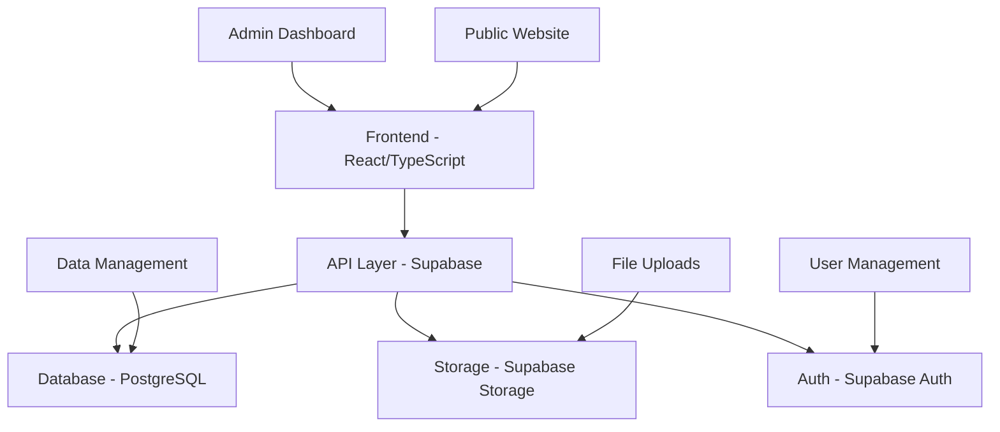

# 🏭 Martka Petroleum - Industrial Equipment Management Platform

<div align="center">


**A comprehensive industrial equipment management and company showcase platform built with modern web technologies**

[](https://reactjs.org/)
[](https://www.typescriptlang.org/)
[](https://vitejs.dev/)
[](https://supabase.com/)
[](https://tailwindcss.com/)

[🚀 Live Demo](https://your-domain.com) • [📖 Documentation](https://docs.your-domain.com) • [🐛 Report Bug](https://github.com/your-repo/issues)

</div>

---

## 📖 Table of Contents

- [✨ Overview](#-overview)
- [🌟 Features](#-features)
- [🏗️ Architecture](#️-architecture)
- [🛠️ Tech Stack](#️-tech-stack)
- [📱 Screenshots](#-screenshots)
- [🚀 Getting Started](#-getting-started)
- [📁 Project Structure](#-project-structure)
- [🔧 Configuration](#-configuration)
- [👨‍💼 Admin Panel](#-admin-panel)
- [🎨 UI Components](#-ui-components)
- [📊 Database Schema](#-database-schema)
- [🔐 Authentication](#-authentication)
- [📂 File Management](#-file-management)
- [🌐 Deployment](#-deployment)
- [🤝 Contributing](#-contributing)
- [📄 License](#-license)

---

## ✨ Overview

**Martka Petroleum** is a full-stack web application designed for industrial equipment companies to showcase their products, manage projects, and provide comprehensive customer support. The platform combines a beautiful public-facing website with a powerful admin dashboard for content management.

### 🎯 Purpose

This platform serves as a complete digital solution for industrial equipment companies, enabling them to:
- **Showcase Products**: Display equipment catalogs with detailed specifications
- **Manage Projects**: Document and present completed industrial projects
- **Provide Support**: Offer customer service through FAQs, downloads, and contact forms
- **Company Presence**: Maintain professional online presence with company information

---

## 🌟 Features

### 🌐 Public Website

<details>
<summary><strong>📋 Product Management</strong></summary>

- **Product Catalog**: Comprehensive equipment listings with categories
- **Advanced Search**: Filter by category, manufacturer, price range
- **Product Details**: Detailed specifications, features, and documentation
- **Image Galleries**: Multiple product images with zoom functionality
- **Comparison Tool**: Side-by-side product comparisons
- **Popular Products**: Featured equipment showcase

</details>

<details>
<summary><strong>🏗️ Project Showcase</strong></summary>

- **Project Gallery**: Visual presentation of completed projects
- **Case Studies**: Detailed project documentation with challenges and solutions
- **Client Testimonials**: Customer feedback and success stories
- **Timeline Views**: Project progression and milestones
- **Team Information**: Project team member details
- **Technical Specifications**: Detailed project requirements and outcomes

</details>

<details>
<summary><strong>🛠️ Services Section</strong></summary>

- **Service Listings**: Comprehensive service offerings
- **Feature Breakdown**: Detailed service capabilities
- **Contact Integration**: Direct service inquiry forms
- **Icon-based Design**: Visual service representation

</details>

<details>
<summary><strong>🏢 Company Information</strong></summary>

- **About Section**: Company history and mission
- **Location Management**: Multiple office/facility locations
- **Interactive Maps**: Google Maps integration for locations
- **Contact Forms**: Multi-purpose contact and inquiry forms
- **Career Opportunities**: Job listings and applications

</details>

### 🎛️ Admin Dashboard

<details>
<summary><strong>📊 Content Management</strong></summary>

- **Dynamic Content Editor**: Real-time content updates
- **Media Management**: File upload and organization
- **SEO Optimization**: Meta tags and content optimization
- **Multi-language Support**: Content localization capabilities

</details>

<details>
<summary><strong>🔧 Product Administration</strong></summary>

- **Product CRUD**: Complete product lifecycle management
- **Category Management**: Product categorization system
- **Bulk Operations**: Mass product updates and imports
- **Image Management**: Multiple image upload with drag-and-drop
- **Specification Editor**: Technical specification management

</details>

<details>
<summary><strong>📈 Analytics & Reporting</strong></summary>

- **User Analytics**: Visitor statistics and behavior
- **Product Performance**: Popular products and engagement metrics
- **Contact Analytics**: Inquiry tracking and response metrics
- **System Health**: Performance monitoring and alerts

</details>

---

## 🏗️ Architecture



### 🔄 Data Flow

1. **Frontend Layer**: React components with TypeScript for type safety
2. **State Management**: TanStack Query for server state management
3. **API Layer**: Supabase client for database operations
4. **Authentication**: Row-level security with Supabase Auth
5. **File Storage**: Supabase Storage for media files
6. **Database**: PostgreSQL with real-time subscriptions

---

## 🛠️ Tech Stack

### **Frontend**
- **⚛️ React 18.3.1** - Modern React with hooks and concurrent features
- **📘 TypeScript** - Type-safe JavaScript development
- **⚡ Vite** - Lightning-fast build tool and dev server
- **🎨 Tailwind CSS** - Utility-first CSS framework
- **🧩 Shadcn/ui** - Beautiful, accessible component library
- **📱 Responsive Design** - Mobile-first responsive layouts

### **Backend & Database**
- **🗄️ Supabase** - Backend-as-a-Service platform
- **🐘 PostgreSQL** - Robust relational database
- **🔐 Row Level Security** - Database-level security policies
- **📁 Supabase Storage** - File storage and CDN
- **🔑 Supabase Auth** - Authentication and user management

### **State Management & API**
- **🔄 TanStack Query** - Server state management
- **📡 Real-time Subscriptions** - Live data updates
- **🎣 React Hook Form** - Form state management
- **✅ Zod** - Schema validation

### **UI & Styling**
- **🎨 Tailwind CSS** - Utility-first styling
- **🌈 Shadcn Components** - Pre-built accessible components
- **🎭 Framer Motion** - Smooth animations
- **📸 React Dropzone** - File upload interface
- **🖼️ Image Optimization** - Responsive image handling

### **Development Tools**
- **📦 NPM** - Package management
- **🔧 ESLint** - Code linting
- **💅 Prettier** - Code formatting
- **🔍 TypeScript Compiler** - Type checking

---

## 📱 Screenshots

<div align="center">

### 🏠 Homepage


### 📱 Mobile Responsive


### 🎛️ Admin Dashboard


</div>

---

## 🚀 Getting Started

### 📋 Prerequisites

Before you begin, ensure you have the following installed:
- **Node.js** (v18.0.0 or higher)
- **NPM** (v8.0.0 or higher)
- **Git** for version control
- **Supabase Account** for backend services

### ⚡ Quick Start

1. **Clone the Repository**
   ```bash
   git clone https://github.com/your-username/martka-petroleum.git
   cd martka-petroleum
   ```

2. **Install Dependencies**
   ```bash
   npm install
   ```

3. **Environment Setup**
   ```bash
   # Copy environment template
   cp .env.example .env.local
   
   # Add your Supabase credentials
   VITE_SUPABASE_URL=your_supabase_url
   VITE_SUPABASE_ANON_KEY=your_supabase_anon_key
   ```

4. **Database Setup**
   ```bash
   # Run Supabase migrations
   npx supabase db reset
   ```

5. **Start Development Server**
   ```bash
   npm run dev
   ```

6. **Open Your Browser**
   Navigate to `http://localhost:8080`

### 🔧 Advanced Setup

<details>
<summary><strong>Supabase Configuration</strong></summary>

1. Create a new Supabase project
2. Run the provided SQL migrations
3. Configure authentication providers
4. Set up storage buckets
5. Configure row-level security policies

</details>

<details>
<summary><strong>Production Build</strong></summary>

```bash
# Build for production
npm run build

# Preview production build
npm run preview
```

</details>

---

## 📁 Project Structure

```
martka-petroleum/
├── 📁 public/                    # Static assets
│   ├── favicon.ico
│   └── placeholder.svg
├── 📁 src/                       # Source code
│   ├── 📁 components/            # React components
│   │   ├── 📁 common/           # Shared components
│   │   ├── 📁 layout/           # Layout components
│   │   ├── 📁 products/         # Product components
│   │   ├── 📁 projects/         # Project components
│   │   ├── 📁 sections/         # Page sections
│   │   └── 📁 ui/               # UI components
│   ├── 📁 hooks/                # Custom React hooks
│   ├── 📁 integrations/         # Third-party integrations
│   │   └── 📁 supabase/         # Supabase configuration
│   ├── 📁 lib/                  # Utility functions
│   ├── 📁 pages/                # Page components
│   │   └── 📁 admin/            # Admin dashboard
│   ├── 📁 types/                # TypeScript definitions
│   ├── App.tsx                  # Main app component
│   ├── main.tsx                 # App entry point
│   └── index.css               # Global styles
├── 📁 supabase/                 # Supabase configuration
│   ├── 📁 migrations/          # Database migrations
│   └── config.toml             # Supabase config
├── package.json                 # Dependencies
├── tailwind.config.ts          # Tailwind configuration
├── tsconfig.json               # TypeScript configuration
├── vite.config.ts              # Vite configuration
└── README.md                   # This file
```

### 🧩 Component Architecture

```
components/
├── common/           # Reusable components
│   ├── SectionSeparator.tsx
│   └── WhatsAppButton.tsx
├── layout/           # Layout structure
│   ├── Header.tsx
│   ├── Footer.tsx
│   └── Layout.tsx
├── products/         # Product-related components
│   ├── ProductCard.tsx
│   ├── ProductFilters.tsx
│   └── ProductComparison.tsx
├── projects/         # Project showcase components
│   ├── ProjectGallery.tsx
│   ├── ProjectTimeline.tsx
│   └── detail/       # Project detail components
└── ui/               # Base UI components
    ├── button.tsx
    ├── card.tsx
    ├── form.tsx
    └── file-upload.tsx
```

---

## 🔧 Configuration

### 🌐 Environment Variables

Create a `.env.local` file in the root directory:

```env
# Supabase Configuration
VITE_SUPABASE_URL=https://your-project.supabase.co
VITE_SUPABASE_ANON_KEY=your-anon-key

# Optional: Custom Domain
VITE_CUSTOM_DOMAIN=https://your-domain.com
```

### ⚙️ Supabase Setup

<details>
<summary><strong>Database Tables</strong></summary>

The application uses the following main tables:
- `products` - Product information and specifications
- `product_categories` - Product categorization
- `projects` - Company project showcase
- `services` - Service offerings
- `locations` - Company locations
- `contact_messages` - Customer inquiries
- `careers` - Job opportunities
- `documents` - Downloadable resources

</details>

<details>
<summary><strong>Storage Buckets</strong></summary>

- `uploads` - General file uploads
- `products` - Product images
- `projects` - Project images
- `documents` - PDF and document files

</details>

---

## 👨‍💼 Admin Panel

### 🔐 Access Control

The admin panel uses role-based access control:
- **Admin Role**: Full system access
- **Editor Role**: Content editing capabilities
- **Viewer Role**: Read-only access

### 📊 Dashboard Features

<details>
<summary><strong>Product Management</strong></summary>

- ➕ **Add Products**: Create new product listings
- ✏️ **Edit Products**: Update product information
- 🗂️ **Categories**: Manage product categories
- 📷 **Image Upload**: Bulk image upload with drag-and-drop
- 📋 **Specifications**: Technical specification editor
- 🏷️ **Tags**: Product tagging system

</details>

<details>
<summary><strong>Project Management</strong></summary>

- 📝 **Project Creation**: Detailed project documentation
- 🖼️ **Gallery Management**: Project image galleries
- ⏱️ **Timeline Editor**: Project milestone tracking
- 👥 **Team Assignment**: Team member management
- 📊 **Case Studies**: Challenge and solution documentation

</details>

<details>
<summary><strong>Content Management</strong></summary>

- 📄 **Page Content**: Dynamic page content editing
- 🎨 **Design Elements**: Color schemes and styling
- 📱 **Responsive Preview**: Mobile/desktop preview
- 🔍 **SEO Settings**: Meta tags and optimization

</details>

### 🎛️ Admin Navigation

The admin sidebar includes:
- 📈 **Dashboard** - Overview and analytics
- 👥 **Users** - User management
- 🛍️ **Products** - Product catalog management
- 🏗️ **Projects** - Project showcase management
- 🔧 **Services** - Service offerings
- 💼 **Careers** - Job posting management
- 💬 **Messages** - Customer inquiries
- 🎫 **Support** - Support ticket management
- 🏢 **Locations** - Office/facility management

---

## 🎨 UI Components

### 🧩 Component Library

The application uses a comprehensive component library built on **Shadcn/ui**:

<details>
<summary><strong>Form Components</strong></summary>

- `Input` - Text input fields
- `Textarea` - Multi-line text input
- `Select` - Dropdown selection
- `Checkbox` - Boolean input
- `RadioGroup` - Single selection from multiple options
- `DatePicker` - Date selection
- `FileUpload` - File upload with drag-and-drop

</details>

<details>
<summary><strong>Display Components</strong></summary>

- `Card` - Content containers
- `Badge` - Status indicators
- `Avatar` - User profile images
- `Skeleton` - Loading placeholders
- `Progress` - Progress indicators
- `Carousel` - Image sliders

</details>

<details>
<summary><strong>Navigation Components</strong></summary>

- `Breadcrumb` - Navigation path
- `Pagination` - Page navigation
- `Tabs` - Tabbed content
- `Sidebar` - Collapsible navigation
- `MenuBar` - Horizontal navigation

</details>

### 🎨 Theming

The application supports:
- 🌙 **Dark/Light Mode** - Theme switching
- 🎨 **Custom Colors** - Brand color customization
- 📱 **Responsive Design** - Mobile-first approach
- ♿ **Accessibility** - WCAG compliant components

---

## 📊 Database Schema

### 🗄️ Core Tables

<details>
<summary><strong>Products Schema</strong></summary>

```sql
products (
  id: integer PRIMARY KEY,
  name: text NOT NULL,
  description: text,
  price: text,
  category_id: bigint REFERENCES product_categories(id),
  manufacturer: text,
  image_url: text,
  gallery: jsonb,
  features: jsonb,
  specifications: jsonb,
  popular: boolean DEFAULT false,
  in_stock: boolean DEFAULT true,
  rating: numeric(2,1),
  warranty: text,
  documents: jsonb,
  created_at: timestamptz DEFAULT now()
)
```

</details>

<details>
<summary><strong>Projects Schema</strong></summary>

```sql
projects (
  id: integer PRIMARY KEY,
  name: text NOT NULL,
  slug: text UNIQUE NOT NULL,
  description: text,
  long_description: text,
  client: text,
  location: text,
  start_date: date,
  end_date: date,
  status: text,
  budget: text,
  area: text,
  category: text,
  year: integer,
  hero_image_url: text,
  gallery_images: jsonb,
  specifications: jsonb,
  timeline: jsonb,
  team_members: jsonb,
  challenges: jsonb,
  solutions: jsonb,
  results: jsonb,
  testimonial: jsonb,
  tags: jsonb,
  created_at: timestamptz DEFAULT now()
)
```

</details>

### 🔐 Security Policies

All tables implement Row Level Security (RLS):
- **Public Read Access** - Anonymous users can view active content
- **Admin Full Access** - Admins can perform all operations
- **User-specific Access** - Users can only access their own data

---

## 🔐 Authentication

### 👤 User Management

The application supports multiple authentication methods:
- 📧 **Email/Password** - Traditional authentication
- 🔗 **Magic Links** - Passwordless login
- 🌐 **OAuth Providers** - Google, GitHub, etc.
- 📱 **Phone Authentication** - SMS-based login

### 🛡️ Security Features

- 🔒 **Row Level Security** - Database-level access control
- 🎫 **JWT Tokens** - Secure session management
- 🔄 **Token Refresh** - Automatic token renewal
- 🚫 **Rate Limiting** - Brute force protection
- 📝 **Audit Logging** - User action tracking

### 👨‍💼 Role-Based Access

```typescript
enum UserRole {
  ADMIN = 'admin',
  EDITOR = 'editor',
  VIEWER = 'viewer'
}
```

---

## 📂 File Management

### 📤 Upload System

The application features a comprehensive file upload system:

<details>
<summary><strong>Upload Features</strong></summary>

- 🖱️ **Drag & Drop** - Intuitive file uploading
- 📷 **Multiple Formats** - Support for images, PDFs, documents
- 📦 **Bulk Upload** - Multiple file upload at once
- 🔄 **Progress Tracking** - Real-time upload progress
- ✅ **Validation** - File type and size validation
- 🗜️ **Compression** - Automatic image optimization

</details>

<details>
<summary><strong>Storage Structure</strong></summary>

```
uploads/
├── products/           # Product images
├── projects/          # Project images
├── documents/         # PDF and documents
├── avatars/          # User profile images
└── temp/             # Temporary uploads
```

</details>

### 🖼️ Image Handling

- **Responsive Images** - Multiple size variants
- **WebP Conversion** - Modern format support
- **Lazy Loading** - Performance optimization
- **CDN Delivery** - Fast global delivery

---

## 🌐 Deployment

### 🚀 Deployment Options

<details>
<summary><strong>Vercel (Recommended)</strong></summary>

1. **Connect Repository**
   ```bash
   # Deploy to Vercel
   npm run build
   vercel --prod
   ```

2. **Environment Variables**
   Set in Vercel dashboard:
   - `VITE_SUPABASE_URL`
   - `VITE_SUPABASE_ANON_KEY`

</details>

<details>
<summary><strong>Netlify</strong></summary>

1. **Build Settings**
   - Build command: `npm run build`
   - Publish directory: `dist`

2. **Environment Variables**
   Configure in Netlify dashboard

</details>

<details>
<summary><strong>Docker</strong></summary>

```dockerfile
FROM node:18-alpine
WORKDIR /app
COPY package*.json ./
RUN npm ci --only=production
COPY . .
RUN npm run build
EXPOSE 8080
CMD ["npm", "run", "preview"]
```

</details>

### 🔧 Production Configuration

- **Build Optimization** - Code splitting and minification
- **Asset Optimization** - Image and CSS optimization
- **Caching Strategy** - Browser and CDN caching
- **Error Monitoring** - Production error tracking
- **Performance Monitoring** - Core web vitals tracking

---

## 🧪 Testing

### 🧪 Testing Strategy

```bash
# Run all tests
npm run test

# Run tests in watch mode
npm run test:watch

# Generate coverage report
npm run test:coverage
```

<details>
<summary><strong>Testing Tools</strong></summary>

- **Vitest** - Unit and integration testing
- **React Testing Library** - Component testing
- **MSW** - API mocking
- **Playwright** - End-to-end testing

</details>

---

## 🤝 Contributing

We welcome contributions! Please see our [Contributing Guide](CONTRIBUTING.md) for details.

### 📝 Development Workflow

1. **Fork** the repository
2. **Create** a feature branch
3. **Make** your changes
4. **Test** your changes
5. **Submit** a pull request

### 🐛 Bug Reports

Please use our [Issue Template](.github/ISSUE_TEMPLATE.md) when reporting bugs.

### 💡 Feature Requests

We'd love to hear your ideas! Please open an issue with the `enhancement` label.

---

## 📊 Performance

### ⚡ Optimization Features

- **Code Splitting** - Lazy-loaded routes and components
- **Tree Shaking** - Unused code elimination
- **Image Optimization** - WebP conversion and responsive images
- **Caching Strategy** - Aggressive caching for static assets
- **Bundle Analysis** - Regular bundle size monitoring

### 📈 Metrics

- **Lighthouse Score**: 95+ across all categories
- **First Contentful Paint**: < 1.5s
- **Time to Interactive**: < 3s
- **Cumulative Layout Shift**: < 0.1

---

## 🔒 Security

### 🛡️ Security Measures

- **SQL Injection Protection** - Parameterized queries
- **XSS Prevention** - Content sanitization
- **CSRF Protection** - Token-based protection
- **Input Validation** - Client and server-side validation
- **Rate Limiting** - API abuse prevention

### 🔐 Data Privacy

- **GDPR Compliance** - Data protection regulations
- **Data Encryption** - At-rest and in-transit encryption
- **Access Logging** - Comprehensive audit trails
- **Data Retention** - Configurable retention policies

---

## 📚 API Documentation

### 🔗 Endpoints

<details>
<summary><strong>Products API</strong></summary>

```typescript
// Get all products
GET /api/products

// Get product by ID
GET /api/products/:id

// Create product (Admin only)
POST /api/products

// Update product (Admin only)
PUT /api/products/:id

// Delete product (Admin only)
DELETE /api/products/:id
```

</details>

<details>
<summary><strong>Projects API</strong></summary>

```typescript
// Get all projects
GET /api/projects

// Get project by slug
GET /api/projects/:slug

// Create project (Admin only)
POST /api/projects

// Update project (Admin only)
PUT /api/projects/:id
```

</details>

---

## 🎯 Roadmap

### 🚧 Upcoming Features

- [ ] **Multi-language Support** - Internationalization
- [ ] **Advanced Analytics** - Detailed user behavior tracking
- [ ] **Mobile App** - React Native companion app
- [ ] **AI Integration** - Smart product recommendations
- [ ] **Live Chat** - Real-time customer support
- [ ] **E-commerce** - Online ordering system
- [ ] **API Integration** - Third-party system connections

### 🔄 Version History

- **v1.0.0** - Initial release with core features
- **v1.1.0** - Added file upload system
- **v1.2.0** - Enhanced admin dashboard
- **v1.3.0** - Improved mobile responsiveness

---

## 📞 Support

### 💬 Getting Help

- 📧 **Email**: support@martka-petroleum.com
- 💬 **Discord**: [Join our community](https://discord.gg/your-server)
- 📖 **Documentation**: [docs.martka-petroleum.com](https://docs.martka-petroleum.com)
- 🐛 **Bug Reports**: [GitHub Issues](https://github.com/your-repo/issues)

### 📖 Resources

- [User Guide](docs/USER_GUIDE.md)
- [API Reference](docs/API_REFERENCE.md)
- [Deployment Guide](docs/DEPLOYMENT.md)
- [Contributing Guidelines](CONTRIBUTING.md)

---

## 📄 License

This project is licensed under the **MIT License** - see the [LICENSE](LICENSE) file for details.

---

## 🙏 Acknowledgments

- **React Team** - For the amazing framework
- **Supabase Team** - For the incredible backend platform
- **Shadcn** - For the beautiful component library
- **Tailwind CSS** - For the utility-first CSS framework
- **Vite Team** - For the lightning-fast build tool

---

<div align="center">

**Built with ❤️ by the Martka Petroleum Team**

[🌟 Star this repo](https://github.com/your-repo) • [🐦 Follow us on Twitter](https://twitter.com/your-handle) • [💼 LinkedIn](https://linkedin.com/company/your-company)

---

*Last updated: December 2024*

</div>
